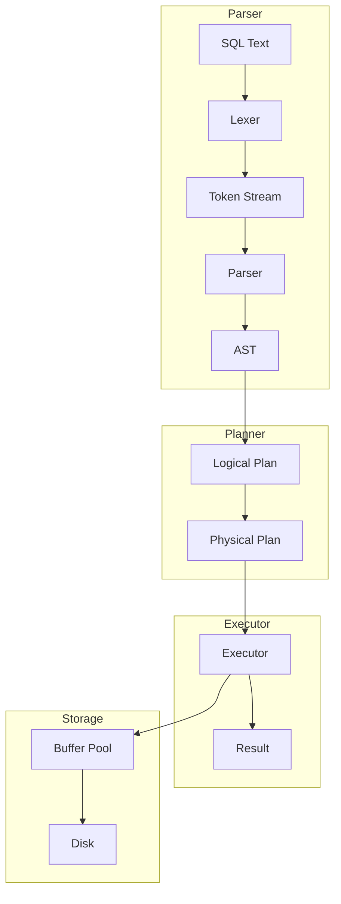

# SQL执行引擎架构图

## 整体架构

## 架构说明

### Parser 层
| 组件 | 功能 |
|------|------|
| SQL Text | 用户输入的SQL语句 |
| Lexer | 词法分析器，将SQL转换为Token流 |
| Token Stream | 令牌流，包含关键字、标识符、字面量等 |
| Parser | 语法分析器，构建抽象语法树 |
| AST | 抽象语法树，表示SQL语句的结构 |

### Planner 层
| 组件 | 功能 |
|------|------|
| Logical Plan | 逻辑执行计划，描述操作的逻辑顺序 |
| Physical Plan | 物理执行计划，包含具体的执行策略 |

### Executor 层
| 组件 | 功能 |
|------|------|
| Executor | 查询执行器，执行物理计划 |
| Result | 执行结果，返回给用户 |

### Storage 层
| 组件 | 功能 |
|------|------|
| Buffer Pool | 缓冲区池，缓存数据页减少磁盘IO |
| Disk | 持久化存储，存储表数据和索引 |

## 数据流向

1. **输入阶段**：用户输入SQL语句
2. **词法分析**：Lexer将SQL文本分解为Token
3. **语法分析**：Parser将Token流解析为AST
4. **计划生成**：Planner将AST转换为执行计划
5. **查询执行**：Executor执行物理计划
6. **数据访问**：通过Buffer Pool访问磁盘数据
7. **结果返回**：将执行结果返回给用户