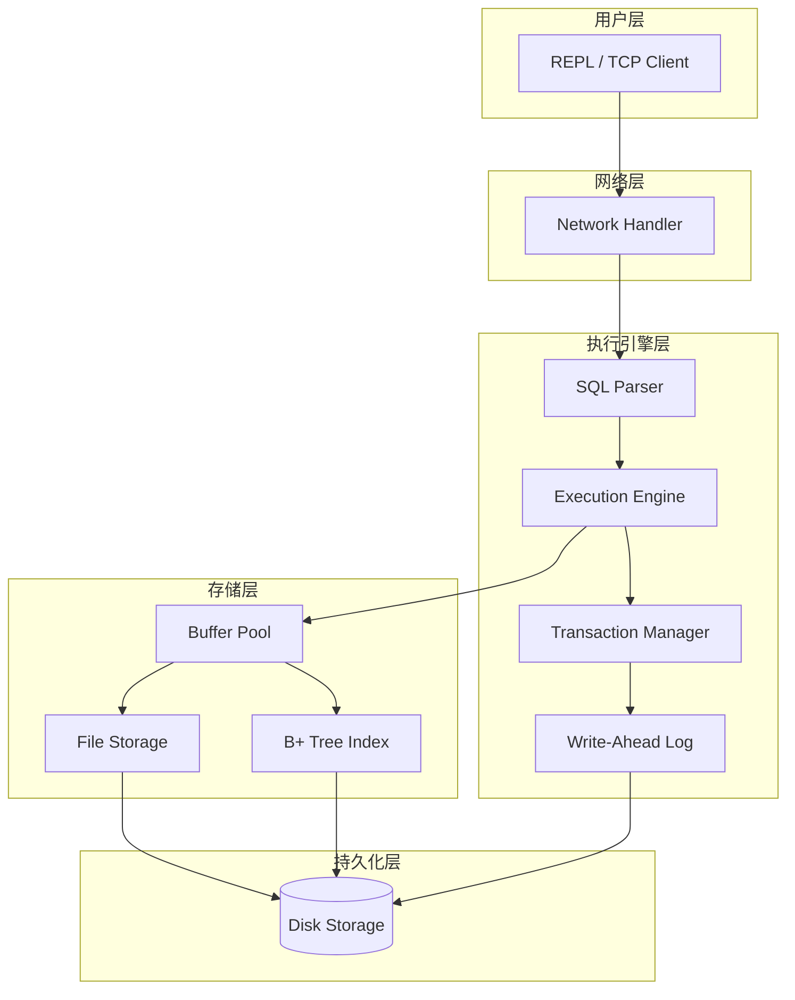
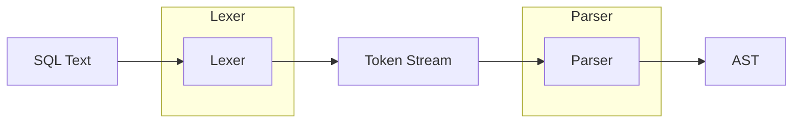
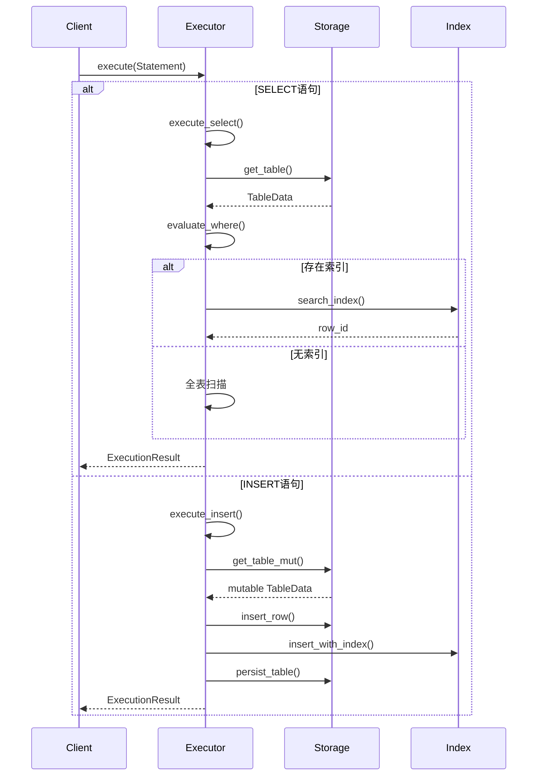
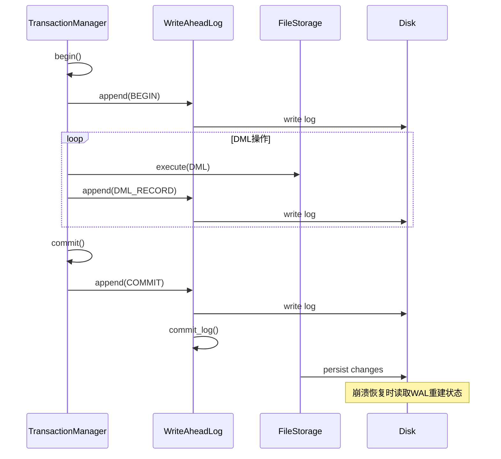
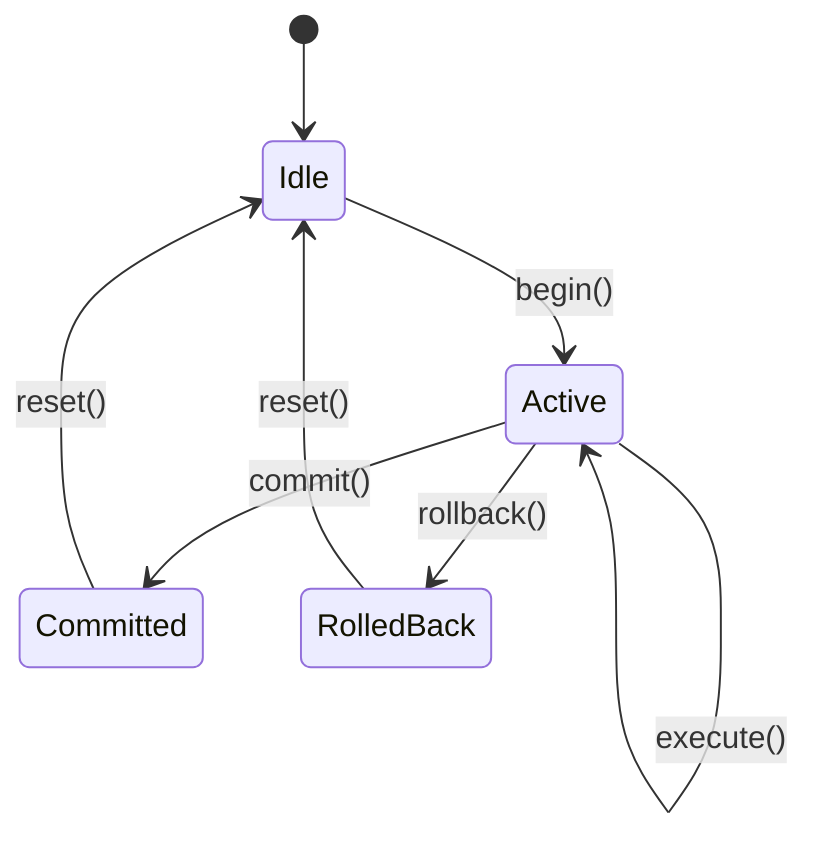
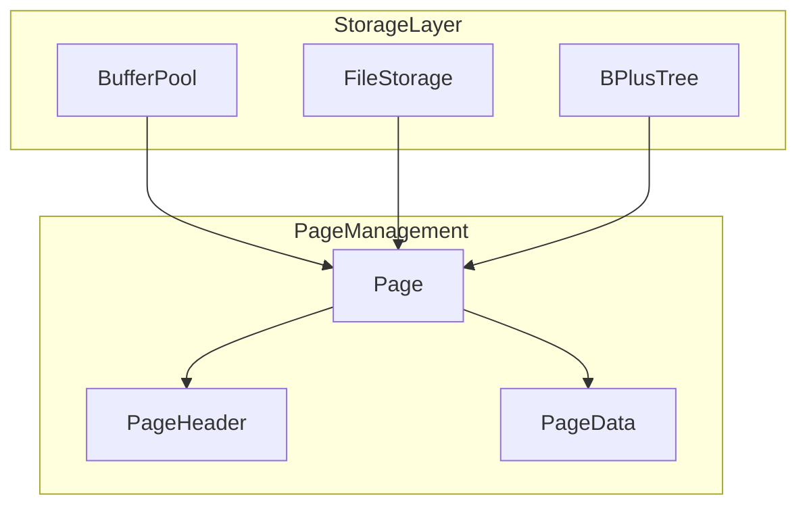
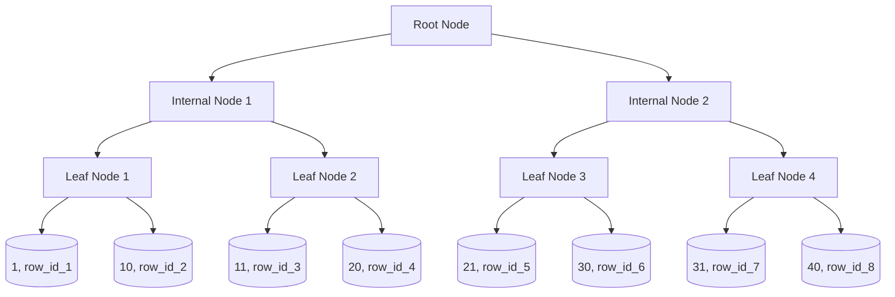
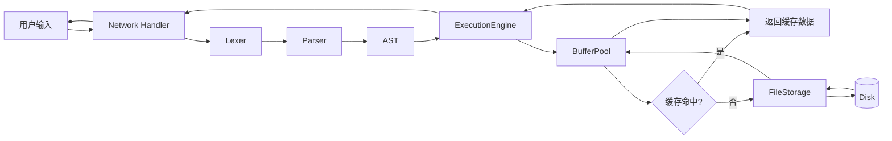
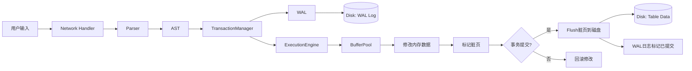
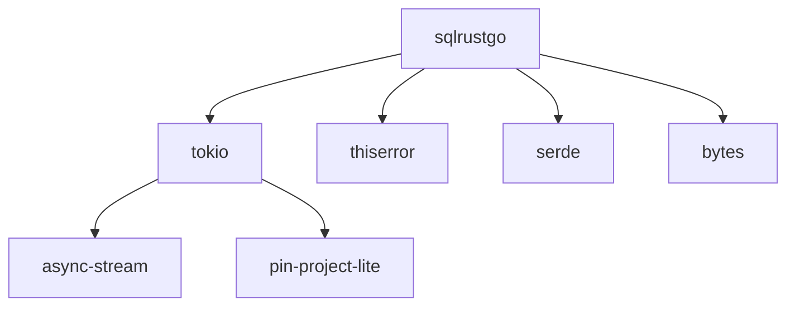

# SQLRustGo 架构设计文档

## 1. 文档概述

### 1.1 文档目的
本文档描述 SQLRustGo 轻量级SQL数据库引擎的整体架构设计，包括系统组件、模块划分、数据流转、核心算法等内容，为开发和维护提供技术参考。

### 1.2 适用范围
本文档适用于 SQLRustGo 项目的开发人员、测试人员和架构师。

### 1.3 术语定义

| 术语 | 定义 |
|------|------|
| AST | 抽象语法树 (Abstract Syntax Tree) |
| WAL | 预写日志 (Write-Ahead Log) |
| DML | 数据操作语言 (Data Manipulation Language) |
| DDL | 数据定义语言 (Data Definition Language) |
| B+ Tree | 一种平衡树索引结构 |
| Buffer Pool | 缓冲区池，用于缓存数据页 |
| Volcano Model | 迭代器风格的查询执行模型 |

---

## 2. 系统架构

### 2.1 整体架构图



### 2.2 分层架构说明

| 层次 | 名称 | 职责 | 核心组件 |
|------|------|------|---------|
| L1 | 用户层 | 提供用户交互接口 | REPL、TCP Client |
| L2 | 网络层 | 处理网络通信 | Network Handler |
| L3 | 执行引擎层 | SQL解析与执行、事务管理 | Parser、Executor、TxManager、WAL |
| L4 | 存储层 | 内存缓存与索引管理 | BufferPool、FileStorage、B+Tree |
| L5 | 持久化层 | 磁盘数据存储 | 文件系统 |

---

## 3. 核心模块设计

### 3.1 SQL解析模块

#### 3.1.1 模块架构



#### 3.1.2 组件职责

| 组件 | 职责 | 输入 | 输出 |
|------|------|------|------|
| Lexer | 词法分析 | SQL字符串 | Token流 |
| Parser | 语法分析 | Token流 | AST |

#### 3.1.3 支持的SQL语法

| 语法类型 | 支持语句 |
|----------|---------|
| DDL | CREATE TABLE, DROP TABLE |
| DML | SELECT, INSERT, UPDATE, DELETE |
| 子句 | WHERE, ORDER BY |

---

### 3.2 查询执行模块

#### 3.2.1 执行引擎架构

```mermaid
graph TB
    subgraph ExecutionEngine
        A[execute()]
        A --> B[execute_select]
        A --> C[execute_insert]
        A --> D[execute_update]
        A --> E[execute_delete]
        A --> F[execute_create_table]
        A --> G[execute_drop_table]
    end
    
    B --> H[evaluate_where]
    B --> I[execute_select_with_index]
    C --> J[expression_to_value]
    D --> H
    E --> H
```

#### 3.2.2 执行流程



#### 3.2.3 核心算法

**WHERE条件求值算法**

```
输入: row[Value], expr[Expression], column_map[HashMap]
输出: bool (匹配结果)

1. 如果 expr 是 BinaryOp:
   a. 递归求值 left 子表达式
   b. 递归求值 right 子表达式
   c. 根据操作符执行比较
   d. 返回比较结果
2. 如果 expr 是 Identifier:
   a. 从 column_map 获取列索引
   b. 从 row 中获取对应值
   c. 返回该值
3. 如果 expr 是 Literal:
   a. 解析字面量为 Value
   b. 返回该值
```

---

### 3.3 事务管理模块

#### 3.3.1 事务架构

```mermaid
graph TB
    subgraph TransactionManager
        A[begin()]
        B[commit()]
        C[rollback()]
        D[is_active()]
    end
    
    subgraph WriteAheadLog
        E[append()]
        F[read_all()]
        G[commit_log()]
        H[recover()]
    end
    
    A --> E
    B --> G
    C --> E
    H --> G
```

#### 3.3.2 WAL工作流程



#### 3.3.3 事务状态机



---

### 3.4 存储引擎模块

#### 3.4.1 存储架构



#### 3.4.2 Buffer Pool 设计

| 属性 | 说明 |
|------|------|
| 容量 | 可配置，默认100页 |
| 替换策略 | LRU (Least Recently Used) |
| 脏页管理 | 定期刷盘 |

#### 3.4.3 B+ Tree 索引结构



---

## 4. 数据流转

### 4.1 查询数据流



### 4.2 更新数据流



---

## 5. 接口设计

### 5.1 执行引擎接口

```rust
pub struct ExecutionEngine {
    buffer_pool: BufferPool,
    storage: FileStorage,
}

impl ExecutionEngine {
    /// 创建执行引擎
    pub fn new() -> Self;
    
    /// 执行SQL语句
    pub fn execute(&mut self, statement: Statement) -> SqlResult<ExecutionResult>;
    
    /// 获取表数据
    pub fn get_table(&self, name: &str) -> Option<&TableData>;
    
    /// 创建索引
    pub fn create_index(&mut self, table_name: &str, column_name: &str) -> SqlResult<()>;
}
```

### 5.2 事务管理接口

```rust
pub struct TransactionManager {
    wal: Arc<WriteAheadLog>,
    transactions: HashMap<TxId, TxState>,
}

impl TransactionManager {
    /// 创建事务管理器
    pub fn new(wal: Arc<WriteAheadLog>) -> Self;
    
    /// 开始事务
    pub fn begin(&self) -> SqlResult<TxId>;
    
    /// 提交事务
    pub fn commit(&self, tx_id: TxId) -> SqlResult<()>;
    
    /// 回滚事务
    pub fn rollback(&self, tx_id: TxId) -> SqlResult<()>;
    
    /// 检查事务状态
    pub fn is_active(&self, tx_id: TxId) -> bool;
}
```

### 5.3 存储层接口

```rust
pub trait Storage {
    /// 获取表
    fn get_table(&self, name: &str) -> Option<&TableData>;
    
    /// 获取可变表引用
    fn get_table_mut(&mut self, name: &str) -> Option<&mut TableData>;
    
    /// 插入表
    fn insert_table(&mut self, name: String, data: TableData) -> SqlResult<()>;
    
    /// 删除表
    fn drop_table(&mut self, name: &str) -> SqlResult<()>;
    
    /// 持久化表
    fn persist_table(&self, name: &str) -> SqlResult<()>;
}
```

---

## 6. 关键类与数据结构

### 6.1 ExecutionResult

```rust
pub struct ExecutionResult {
    pub rows_affected: u64,      // 受影响行数
    pub columns: Vec<String>,     // 列名列表
    pub rows: Vec<Vec<Value>>,    // 结果数据行
}
```

### 6.2 TableData

```rust
pub struct TableData {
    pub info: TableInfo,          // 表元信息
    pub rows: Vec<Vec<Value>>,    // 表数据行
}
```

### 6.3 TableInfo

```rust
pub struct TableInfo {
    pub name: String,                    // 表名
    pub columns: Vec<ColumnDefinition>,  // 列定义列表
}
```

### 6.4 Value

```rust
pub enum Value {
    Null,               // 空值
    Integer(i64),       // 整数
    Float(f64),         // 浮点数
    Text(String),       // 文本
    Boolean(bool),      // 布尔值
}
```

---

## 7. 部署与集成

### 7.1 依赖关系



### 7.2 环境要求

| 依赖 | 版本 | 说明 |
|------|------|------|
| Rust | 1.94.0+ | 编程语言 |
| Cargo | 1.94.0+ | 构建工具 |
| Tokio | 1.0+ | 异步运行时 |

---

## 8. 代码安全性

### 8.1 注意事项

| 风险类型 | 描述 | 关联模块 |
|----------|------|---------|
| SQL注入 | 用户输入可能包含恶意SQL | Parser、Executor |
| 资源泄漏 | 文件句柄、内存未正确释放 | Storage、Transaction |
| 并发安全 | 多线程访问共享数据 | BufferPool、TxManager |
| 数据丢失 | WAL未正确写入导致数据丢失 | WAL |

### 8.2 解决方案

| 风险类型 | 解决方案 |
|----------|---------|
| SQL注入 | 使用参数化查询，禁止字符串拼接 |
| 资源泄漏 | 使用RAII模式，自动释放资源 |
| 并发安全 | 使用Arc/RwLock保证线程安全 |
| 数据丢失 | WAL写入成功后才执行实际更新 |

---

## 9. 附录

### 9.1 模块目录结构

```
src/
├── executor/          # 查询执行引擎
│   └── mod.rs
├── lexer/             # 词法分析器
│   ├── lexer.rs
│   ├── token.rs
│   └── mod.rs
├── parser/            # 语法分析器
│   └── mod.rs
├── storage/           # 存储引擎
│   ├── bplus_tree/
│   ├── buffer_pool.rs
│   ├── file_storage.rs
│   ├── page.rs
│   └── mod.rs
├── transaction/       # 事务管理
│   ├── manager.rs
│   ├── wal.rs
│   └── mod.rs
├── network/           # 网络通信
│   └── mod.rs
├── types/             # 类型定义
│   ├── error.rs
│   ├── value.rs
│   └── mod.rs
├── lib.rs             # 库入口
└── main.rs            # REPL入口
```

### 9.2 流程图符号说明

| 符号 | 含义 |
|------|------|
| 圆角矩形 | 流程开始/结束 |
| 矩形 | 处理步骤 |
| 菱形 | 判断/决策 |
| 平行四边形 | 输入/输出 |
| 箭头 | 数据流方向 |
| 圆形 | 连接点 |

---

**版本**: v1.0.0  
**创建日期**: 2026年6月  
**作者**: SQLRustGo Development Team