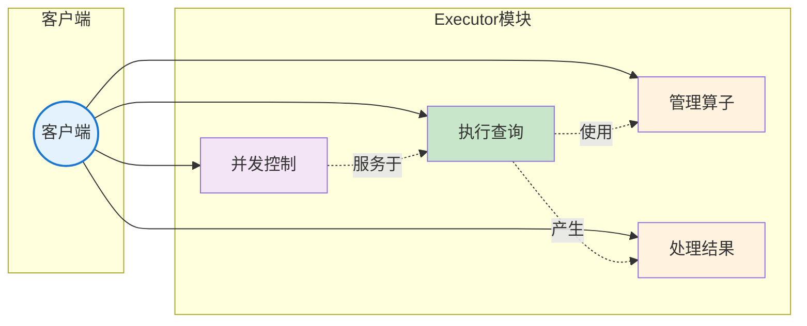
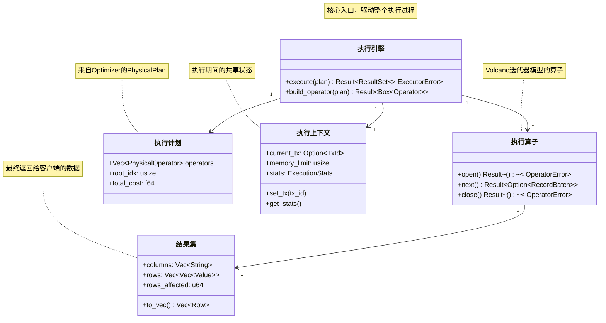
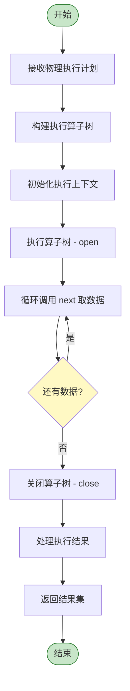
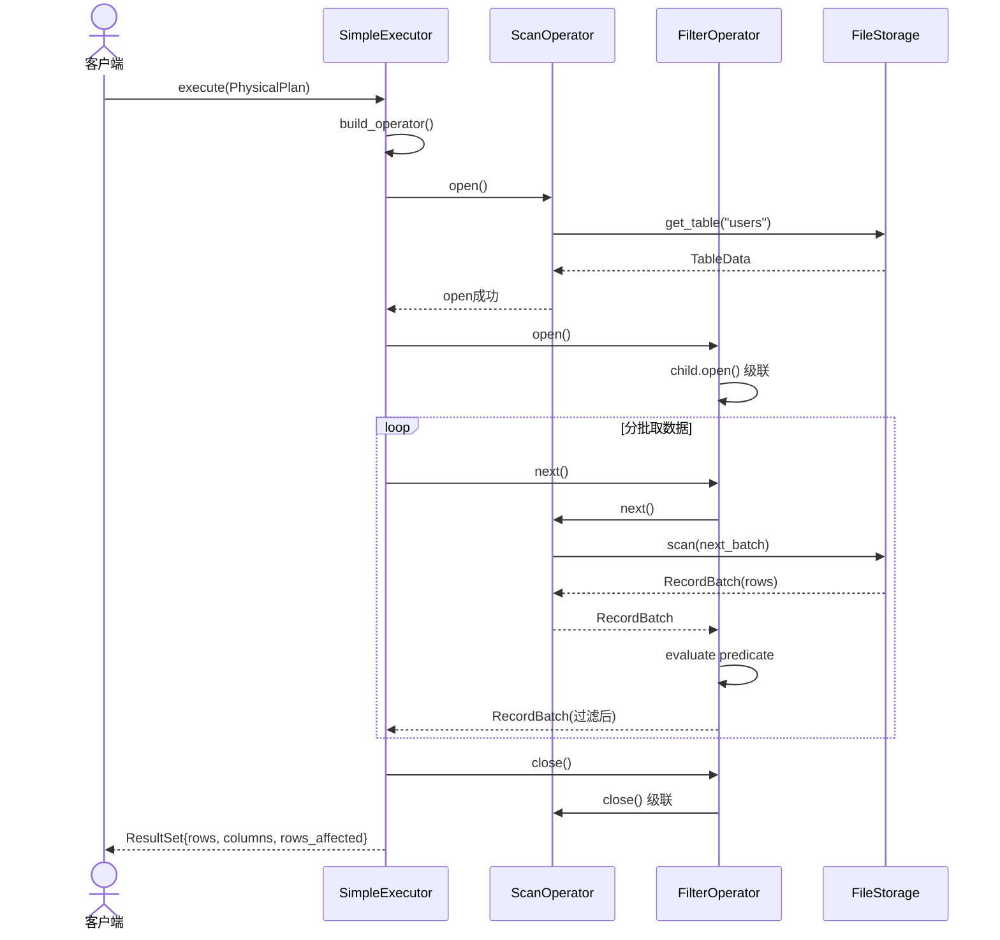
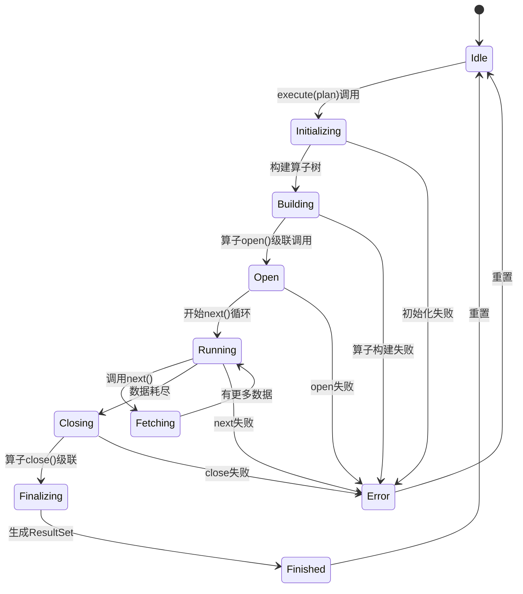
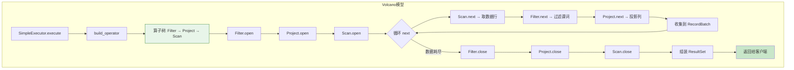
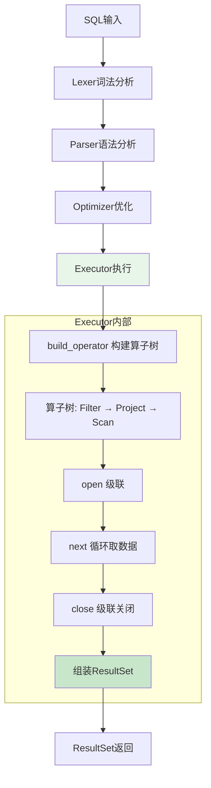

# SQLRustGo 1.0 Executor 模块设计

## 一、OOA 分析

### 1. 用例图



### 2. 概念类图



### 3. 活动图



---

## 二、OOD 设计

### 1. 设计类图

```mermaid
classDiagram
    class Executor {
        <<interface>>
        +execute(plan: &PhysicalPlan) Result~ResultSet~~ ExecutorError~
    }
    
    class Operator {
        <<interface>>
        +open() Result~()~~ OperatorError~
        +next() Result~Option~RecordBatch~~ OperatorError~
        +close() Result~()~~ OperatorError~
    }
    
    class SimpleExecutor {
        -context: ExecutionContext
        +new() SimpleExecutor
        +execute(plan: &PhysicalPlan) Result~ResultSet~~ ExecutorError~
        +build_operator(plan: &PhysicalPlan) Result~Box~dyn Operator~~
        +execute_batch(op: &mut Box~dyn Operator~) Result~Vec~RecordBatch~~
    }
    
    class ScanOperator {
        -storage: Box~dyn StorageEngine~
        -table: String
        -projection: Vec~String~
        -filter: Option~Predicate~
        -current_row: usize
        -total_rows: usize
        +open() Result~()~~ OperatorError~
        +next() Result~Option~RecordBatch~~ OperatorError~
        +close() Result~()~~ OperatorError~
    }
    
    class IndexScanOperator {
        -storage: Box~dyn StorageEngine~
        -index: Box~BPlusTree~
        -table: String
        -projection: Vec~String~
        -key_range: KeyRange
        -filter: Option~Predicate~
        +open() Result~()~~ OperatorError~
        +next() Result~Option~RecordBatch~~ OperatorError~
        +close() Result~()~~ OperatorError~
    }
    
    class FilterOperator {
        -child: Box~dyn Operator~
        -predicate: Predicate
        -child_buffer: Vec~Value~
        +open() Result~()~~ OperatorError~
        +next() Result~Option~RecordBatch~~ OperatorError~
        +close() Result~()~~ OperatorError~
        +evaluate(row) bool
    }
    
    class ProjectOperator {
        -child: Box~dyn Operator~
        -projections: Vec~Expr~
        -column_map: HashMap~String, usize~
        +open() Result~()~~ OperatorError~
        +next() Result~Option~RecordBatch~~ OperatorError~
        +close() Result~()~~ OperatorError~
        +project(row) Vec~Value~
    }
    
    class NestedLoopJoinOperator {
        -left: Box~dyn Operator~
        -right: Box~dyn Operator~
        -on: Predicate
        -left_row: Option~Vec~Value~~
        -right_rows: Vec~Vec~Value~~
        -join_type: JoinType
        +open() Result~()~~ OperatorError~
        +next() Result~Option~RecordBatch~~ OperatorError~
        +close() Result~()~~ OperatorError~
    }
    
    class LimitOperator {
        -child: Box~dyn Operator~
        -limit: usize
        -offset: usize
        -returned: usize
        -skipped: usize
        +open() Result~()~~ OperatorError~
        +next() Result~Option~RecordBatch~~ OperatorError~
        +close() Result~()~~ OperatorError~
    }
    
    class InsertOperator {
        -storage: Box~dyn StorageEngine~
        -table: String
        -columns: Option~Vec~String~~
        -values: Vec~Vec~Value~~
        -inserted: usize
        +open() Result~()~~ OperatorError~
        +next() Result~Option~RecordBatch~~ OperatorError~
        +close() Result~()~~ OperatorError~
    }
    
    class UpdateOperator {
        -storage: Box~dyn StorageEngine~
        -table: String
        -updates: Vec~(String, Expr)~
        -filter: Option~Predicate~
        -updated: usize
        +open() Result~()~~ OperatorError~
        +next() Result~Option~RecordBatch~~ OperatorError~
        +close() Result~()~~ OperatorError~
    }
    
    class DeleteOperator {
        -storage: Box~dyn StorageEngine~
        -table: String
        -filter: Option~Predicate~
        -deleted: usize
        +open() Result~()~~ OperatorError~
        +next() Result~Option~RecordBatch~~ OperatorError~
        +close() Result~()~~ OperatorError~
    }
    
    Executor <|.. SimpleExecutor : 实现
    Operator <|.. ScanOperator : 实现
    Operator <|.. IndexScanOperator : 实现
    Operator <|.. FilterOperator : 实现
    Operator <|.. ProjectOperator : 实现
    Operator <|.. NestedLoopJoinOperator : 实现
    Operator <|.. LimitOperator : 实现
    Operator <|.. InsertOperator : 实现
    Operator <|.. UpdateOperator : 实现
    Operator <|.. DeleteOperator : 实现
    
    SimpleExecutor --> Operator : 构建
    ScanOperator --> StorageEngine : 依赖
    IndexScanOperator --> StorageEngine : 依赖
    IndexScanOperator --> BPlusTree : 使用索引
    InsertOperator --> StorageEngine : 写入
    UpdateOperator --> StorageEngine : 更新
    DeleteOperator --> StorageEngine : 删除
```



### 2. 顺序图



### 3. 状态图



### 4. 组件图

```mermaid
graph TB
    subgraph Executor组件
        E[SimpleExecutor]
        E1[Operator Tree<br/>Volcano模型]
        E2[ExecutionContext]
        E3[ResultSet]
        E --> E1
        E --> E2
        E --> E3
    end
    
    subgraph Storage组件
        S1[FileStorage]
        S2[BPlusTree]
        S1 --> S2
    end
    
    subgraph Common
        C1[PhysicalPlan]
        C2[PhysicalOperator]
        C3[Value]
        C4[Predicate]
    end
    
    E1 --> S1 : 数据存取
    E --> C1
    E1 --> C2
    E3 --> C3
    E1 --> C4
    
    style E fill:#e8f5e9
    style E1 fill:#c8e6c9
    style E2 fill:#c8e6c9
    style E3 fill:#c8e6c9
    style S1 fill:#fce4ec
    style S2 fill:#fce4ec
```

---

## 三、详细设计文档

### 1. 模块概述

Executor 模块是 SQLRustGo 的查询执行核心，采用 **Volcano迭代器模型**（Iterator Model）实现算子化执行。每个算子实现 open/next/close 三接口，算子以树状结构组织，父算子通过调用子算子的 next() 方法获取数据，实现流水线式的数据处理。

**设计目标：**
- 1.0版本：实现核心CRUD算子 + 迭代器框架
- 1.1版本：实现聚合算子 + 哈希连接
- 1.2版本：实现向量化执行（批处理优化）

### 2. 核心功能

| 功能 | 描述 | 1.0状态 |
|------|------|---------|
| Volcano算子模型 | open/next/close三接口 | ✅ 实现 |
| 扫描算子 | 全表扫描、索引扫描 | ✅ 实现 |
| 过滤算子 | WHERE条件过滤 | ✅ 实现 |
| 投影算子 | SELECT列投影 | ✅ 实现 |
| 嵌套循环连接 | JOIN on条件 | ✅ 实现（基础） |
| Limit算子 | LIMIT/OFFSET | ✅ 实现 |
| INSERT算子 | 数据插入 | ✅ 实现 |
| UPDATE算子 | 数据更新 | ✅ 实现 |
| DELETE算子 | 数据删除 | ✅ 实现 |
| 结果集处理 | 组装ResultSet返回 | ✅ 实现 |
| 执行上下文 | 共享状态+统计 | ✅ 实现 |
| 聚合算子 | GROUP BY + 聚合函数 | ⚠️ 部分实现 |
| 哈希连接 | 大结果集连接 | ❌ 1.1版本 |
| 向量化执行 | RecordBatch批处理 | ❌ 1.2版本 |

### 3. 类与接口设计

#### 3.1 核心接口

```rust
pub trait Executor {
    fn execute(&self, plan: &PhysicalPlan) -> SqlResult<ResultSet>;
}

pub trait Operator {
    fn open(&mut self) -> SqlResult<()>;
    fn next(&mut self) -> SqlResult<Option<RecordBatch>>;
    fn close(&mut self) -> SqlResult<()>;
}

pub trait StorageEngine {
    fn get_table(&self, name: &str) -> Option<&TableData>;
    fn get_table_mut(&mut self, name: &str) -> Option<&mut TableData>;
    fn insert_table(&mut self, name: String, data: TableData) -> SqlResult<()>;
    fn drop_table(&mut self, name: &str) -> SqlResult<()>;
    fn persist_table(&self, name: &str) -> SqlResult<()>;
}
```

#### 3.2 执行上下文

```rust
pub struct ExecutionContext {
    pub current_tx: Option<u64>,
    pub memory_limit: usize,
    pub stats: ExecutionStats,
}

pub struct ExecutionStats {
    pub rows_scanned: u64,
    pub rows_filtered: u64,
    pub rows_returned: u64,
    pub io_reads: u64,
    pub io_writes: u64,
    pub execution_time_ms: u64,
}

pub struct SimpleExecutor {
    context: ExecutionContext,
    storage: Box<dyn StorageEngine>,
}
```

#### 3.3 结果结构

```rust
pub struct RecordBatch {
    pub columns: Vec<String>,
    pub rows: Vec<Vec<Value>>,
}

pub struct ResultSet {
    pub columns: Vec<String>,
    pub rows: Vec<Vec<Value>>,
    pub rows_affected: u64,
}
```

#### 3.4 谓词求值器

```rust
pub struct PredicateEvaluator;

impl PredicateEvaluator {
    pub fn evaluate(predicate: &Predicate, row: &[Value], column_map: &HashMap<String, usize>) -> bool {
        match predicate {
            Predicate::Compare { left, op, right } => {
                let l = Self::eval_expr(left, row, column_map);
                let r = Self::eval_expr(right, row, column_map);
                Self::compare_values(&l, op, &r)
            }
            Predicate::And(preds) => preds.iter().all(|p| Self::evaluate(p, row, column_map)),
            Predicate::Or(preds) => preds.iter().any(|p| Self::evaluate(p, row, column_map)),
            _ => false,
        }
    }
    
    pub fn compare_values(l: &Value, op: &CompareOp, r: &Value) -> bool {
        match (l, op, r) {
            (Value::Integer(a), CompareOp::Eq, Value::Integer(b)) => a == b,
            (Value::Integer(a), CompareOp::Lt, Value::Integer(b)) => a < b,
            (Value::Integer(a), CompareOp::Le, Value::Integer(b)) => a <= b,
            (Value::Integer(a), CompareOp::Gt, Value::Integer(b)) => a > b,
            (Value::Integer(a), CompareOp::Ge, Value::Integer(b)) => a >= b,
            (Value::Text(a), CompareOp::Eq, Value::Text(b)) => a == b,
            (Value::Text(a), CompareOp::Lt, Value::Text(b)) => a < b,
            _ => false,
        }
    }
}
```

### 4. 执行流程



**算子树构建算法：**

```rust
fn build_operator(&self, plan: &PhysicalPlan, node_idx: usize) -> SqlResult<Box<dyn Operator>> {
    let op = &plan.operators[node_idx];
    match op {
        PhysicalOperator::TableScan { table, projection, access_path } => {
            let storage = self.storage.clone();
            Ok(Box::new(ScanOperator::new(storage, table.clone(), projection.clone(), None)))
        }
        PhysicalOperator::IndexScan { table, index, key_range, projection } => {
            let storage = self.storage.clone();
            Ok(Box::new(IndexScanOperator::new(storage, table.clone(), index.clone(), key_range.clone(), projection.clone())))
        }
        PhysicalOperator::Filter { predicate, child_idx, .. } => {
            let child = self.build_operator(plan, *child_idx)?;
            Ok(Box::new(FilterOperator::new(child, predicate.clone())))
        }
        PhysicalOperator::Project { columns, child_idx } => {
            let child = self.build_operator(plan, *child_idx)?;
            Ok(Box::new(ProjectOperator::new(child, columns.clone())))
        }
        PhysicalOperator::Limit { limit, offset, child_idx } => {
            let child = self.build_operator(plan, *child_idx)?;
            Ok(Box::new(LimitOperator::new(child, *limit, *offset)))
        }
        PhysicalOperator::NestedLoopJoin { left_idx, right_idx, on, .. } => {
            let left = self.build_operator(plan, *left_idx)?;
            let right = self.build_operator(plan, *right_idx)?;
            Ok(Box::new(NestedLoopJoinOperator::new(left, right, on.clone(), JoinType::Inner)))
        }
        _ => Err(SqlError::NotImplemented),
    }
}
```

### 5. 算子设计

#### 5.1 ScanOperator（全表扫描）

```rust
pub struct ScanOperator {
    storage: Box<dyn StorageEngine>,
    table_name: String,
    projection: Vec<String>,
    filter: Option<Predicate>,
    table_cols: Vec<String>,
    row_idx: usize,
    open: bool,
}

impl ScanOperator {
    pub fn new(storage: Box<dyn StorageEngine>, table_name: String, projection: Vec<String>, filter: Option<Predicate>) -> Self {
        Self { storage, table_name, projection, filter, table_cols: vec![], row_idx: 0, open: false }
    }
}

impl Operator for ScanOperator {
    fn open(&mut self) -> SqlResult<()> {
        let table = self.storage.get_table(&self.table_name)
            .ok_or_else(|| SqlError::TableNotFound(self.table_name.clone()))?;
        self.table_cols = table.info.columns.iter().map(|c| c.name.clone()).collect();
        self.open = true;
        Ok(())
    }
    
    fn next(&mut self) -> SqlResult<Option<RecordBatch>> {
        if !self.open { return Ok(None); }
        let table = self.storage.get_table(&self.table_name).unwrap();
        let mut batch_rows: Vec<Vec<Value>> = Vec::new();
        let batch_size = 1000;
        
        while self.row_idx < table.rows.len() && batch_rows.len() < batch_size {
            let row = &table.rows[self.row_idx];
            if let Some(pred) = &self.filter {
                let col_map: HashMap<String, usize> = self.table_cols.iter()
                    .enumerate().map(|(i, c)| (c.clone(), i)).collect();
                if !PredicateEvaluator::evaluate(pred, row, &col_map) {
                    self.row_idx += 1;
                    continue;
                }
            }
            if self.projection.is_empty() {
                batch_rows.push(row.clone());
            } else {
                let projected: Vec<Value> = self.projection.iter()
                    .filter_map(|col| {
                        self.table_cols.iter().position(|c| c == col)
                            .map(|i| row[i].clone())
                    }).collect();
                batch_rows.push(projected);
            }
            self.row_idx += 1;
        }
        
        if batch_rows.is_empty() { Ok(None) }
        else { Ok(Some(RecordBatch { columns: self.projection.clone(), rows: batch_rows })) }
    }
    
    fn close(&mut self) -> SqlResult<()> {
        self.open = false;
        Ok(())
    }
}
```

#### 5.2 FilterOperator

```rust
pub struct FilterOperator {
    child: Box<dyn Operator>,
    predicate: Predicate,
    column_map: HashMap<String, usize>,
    current_columns: Vec<String>,
}

impl FilterOperator {
    pub fn new(child: Box<dyn Operator>, predicate: Predicate) -> Self {
        Self { child, predicate, column_map: HashMap::new(), current_columns: vec![] }
    }
}

impl Operator for FilterOperator {
    fn open(&mut self) -> SqlResult<()> {
        self.child.open()
    }
    
    fn next(&mut self) -> SqlResult<Option<RecordBatch>> {
        if let Some(batch) = self.child.next()? {
            if self.column_map.is_empty() {
                self.column_map = batch.columns.iter()
                    .enumerate().map(|(i, c)| (c.clone(), i)).collect();
                self.current_columns = batch.columns.clone();
            }
            let filtered: Vec<Vec<Value>> = batch.rows.into_iter()
                .filter(|row| PredicateEvaluator::evaluate(&self.predicate, row, &self.column_map))
                .collect();
            if filtered.is_empty() { self.next() }
            else { Ok(Some(RecordBatch { columns: self.current_columns.clone(), rows: filtered })) }
        } else { Ok(None) }
    }
    
    fn close(&mut self) -> SqlResult<()> {
        self.child.close()
    }
}
```

#### 5.3 InsertOperator

```rust
pub struct InsertOperator {
    storage: Box<dyn StorageEngine>,
    table_name: String,
    columns: Option<Vec<String>>,
    values: Vec<Vec<Value>>,
    inserted: usize,
}

impl InsertOperator {
    pub fn new(storage: Box<dyn StorageEngine>, table_name: String, columns: Option<Vec<String>>, values: Vec<Vec<Value>>) -> Self {
        Self { storage, table_name, columns, values, inserted: 0 }
    }
}

impl Operator for InsertOperator {
    fn open(&mut self) -> SqlResult<()> {
        Ok(())
    }
    
    fn next(&mut self) -> SqlResult<Option<RecordBatch>> {
        let table = self.storage.get_table_mut(&self.table_name)
            .ok_or_else(|| SqlError::TableNotFound(self.table_name.clone()))?;
        
        let col_map: HashMap<String, usize> = table.info.columns.iter()
            .enumerate().map(|(i, c)| (c.name.clone(), i)).collect();
        
        for value_row in &self.values {
            let mut row = vec![Value::Null; table.rows.first().map(|r| r.len()).unwrap_or(table.info.columns.len())];
            if let Some(cols) = &self.columns {
                for (col_name, val) in cols.iter().zip(value_row.iter()) {
                    if let Some(idx) = col_map.get(col_name) {
                        row[*idx] = val.clone();
                    }
                }
            } else {
                for (i, val) in value_row.iter().enumerate() {
                    if i < row.len() { row[i] = val.clone(); }
                }
            }
            table.rows.push(row);
            self.inserted += 1;
        }
        
        self.storage.persist_table(&self.table_name)?;
        
        Ok(None)
    }
    
    fn close(&mut self) -> SqlResult<()> { Ok(()) }
}
```

#### 5.4 NestedLoopJoinOperator（嵌套循环连接）

```rust
pub struct NestedLoopJoinOperator {
    left: Box<dyn Operator>,
    right: Box<dyn Operator>,
    predicate: Predicate,
    join_type: JoinType,
    left_buffer: Vec<Vec<Value>>,
    right_buffer: Vec<Vec<Value>>,
    left_cols: Vec<String>,
    right_cols: Vec<String>,
    left_idx: usize,
    right_idx: usize,
    exhausted: bool,
}

impl NestedLoopJoinOperator {
    pub fn new(left: Box<dyn Operator>, right: Box<dyn Operator>, predicate: Predicate, join_type: JoinType) -> Self {
        Self { left, right, predicate, join_type, left_buffer: vec![], right_buffer: vec![], left_cols: vec![], right_cols: vec![], left_idx: 0, right_idx: 0, exhausted: false }
    }
    
    fn col_map(cols: &[String]) -> HashMap<String, usize> {
        cols.iter().enumerate().map(|(i, c)| (c.clone(), i)).collect()
    }
}

impl Operator for NestedLoopJoinOperator {
    fn open(&mut self) -> SqlResult<()> {
        self.left.open()?;
        self.right.open()?;
        
        while let Some(batch) = self.left.next()? {
            if self.left_cols.is_empty() { self.left_cols = batch.columns.clone(); }
            self.left_buffer.extend(batch.rows);
        }
        while let Some(batch) = self.right.next()? {
            if self.right_cols.is_empty() { self.right_cols = batch.columns.clone(); }
            self.right_buffer.extend(batch.rows);
        }
        self.right.close()?;
        
        self.exhausted = self.left_buffer.is_empty() || self.right_buffer.is_empty();
        Ok(())
    }
    
    fn next(&mut self) -> SqlResult<Option<RecordBatch>> {
        if self.exhausted { return Ok(None); }
        let left_map = Self::col_map(&self.left_cols);
        let right_map = Self::col_map(&self.right_cols);
        
        let mut result: Vec<Vec<Value>> = Vec::new();
        let combined_cols: Vec<String> = self.left_cols.iter()
            .chain(self.right_cols.iter()).cloned().collect();
        
        while self.left_idx < self.left_buffer.len() && result.len() < 1000 {
            let left_row = &self.left_buffer[self.left_idx];
            let mut matched = false;
            
            while self.right_idx < self.right_buffer.len() {
                let right_row = &self.right_buffer[self.right_idx];
                let mut combined = left_row.clone();
                combined.extend(right_row.iter().cloned());
                
                let combined_map: HashMap<String, usize> = combined_cols.iter()
                    .enumerate().map(|(i, c)| (c.clone(), i)).collect();
                
                if PredicateEvaluator::evaluate(&self.predicate, &combined, &combined_map) {
                    result.push(combined);
                    matched = true;
                }
                self.right_idx += 1;
            }
            
            if !matched && matches!(self.join_type, JoinType::Left) {
                let mut padded = left_row.clone();
                padded.extend(vec![Value::Null; self.right_cols.len()]);
                result.push(padded);
            }
            
            self.right_idx = 0;
            self.left_idx += 1;
        }
        
        if result.is_empty() { self.exhausted = true; Ok(None) }
        else { Ok(Some(RecordBatch { columns: combined_cols, rows: result })) }
    }
    
    fn close(&mut self) -> SqlResult<()> {
        self.left.close()?;
        self.exhausted = true;
        Ok(())
    }
}
```

### 6. 性能考虑

| 方面 | 考虑 | 1.0实现 |
|------|------|---------|
| **算子批处理** | RecordBatch批量返回，避免逐行 | ✅ batch_size=1000 |
| **谓词短路求值** | AND/OR左右短路 | ✅ Rust原生语义 |
| **内存控制** | ExecutionContext.memory_limit限制 | ✅ 框架预留 |
| **Join算法选择** | 小结果集用NLJ，大结果集用HashJoin | ⚠️ 1.0仅NLJ |
| **索引利用** | IndexScan避免全表扫描 | ✅ IndexScanOperator |
| **列裁剪下推** | 投影下推到Scan减少I/O | ✅ Scan自带projection |
| **谓词下推** | Filter在Scan之后立即过滤 | ✅ 算子树结构保证 |
| **流式执行** | Volcano模型自然流水线 | ✅ 惰性next() |
| **连接缓冲** | NLJ全载入内存 | ⚠️ 1.0内存足够场景 |
| **向量化执行** | 批处理并行计算 | ❌ 1.2版本 |

### 7. 执行流程总览



### 8. 1.0版本实现清单

| 序号 | 组件 | 实现内容 | 优先级 |
|------|------|----------|--------|
| 1 | SimpleExecutor | execute + build_operator | P0 |
| 2 | ScanOperator | 全表扫描 + 投影 | P0 |
| 3 | FilterOperator | 谓词过滤 + 谓词下推 | P0 |
| 4 | ProjectOperator | 列投影 | P0 |
| 5 | InsertOperator | INSERT VALUES | P0 |
| 6 | UpdateOperator | UPDATE SET WHERE | P0 |
| 7 | DeleteOperator | DELETE FROM WHERE | P0 |
| 8 | PredicateEvaluator | 谓词求值器 | P0 |
| 9 | ResultSet / RecordBatch | 结果结构 | P0 |
| 10 | ExecutionContext | 执行上下文 | P1 |
| 11 | IndexScanOperator | 索引扫描 | P1 |
| 12 | NestedLoopJoinOperator | 嵌套循环连接 | P1 |
| 13 | LimitOperator | LIMIT/OFFSET | P1 |
| 14 | AggregateOperator | GROUP BY | P2 |
