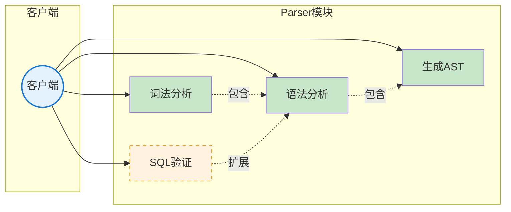
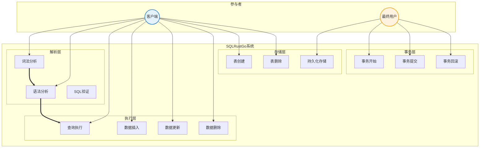
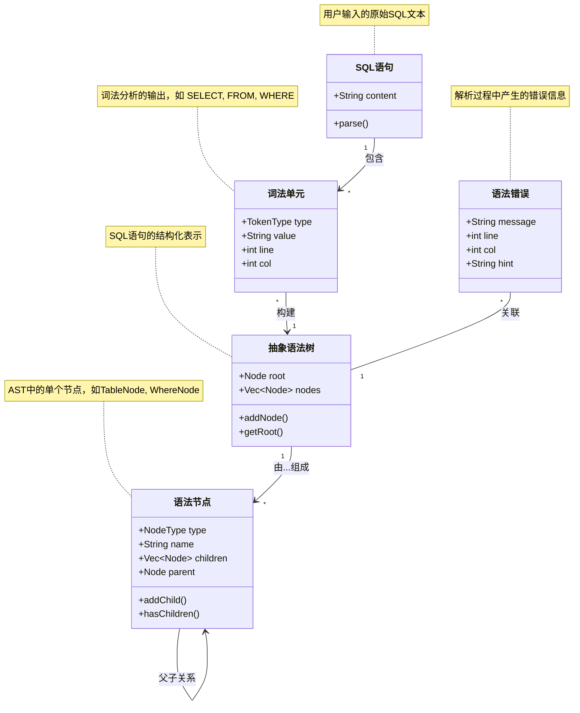
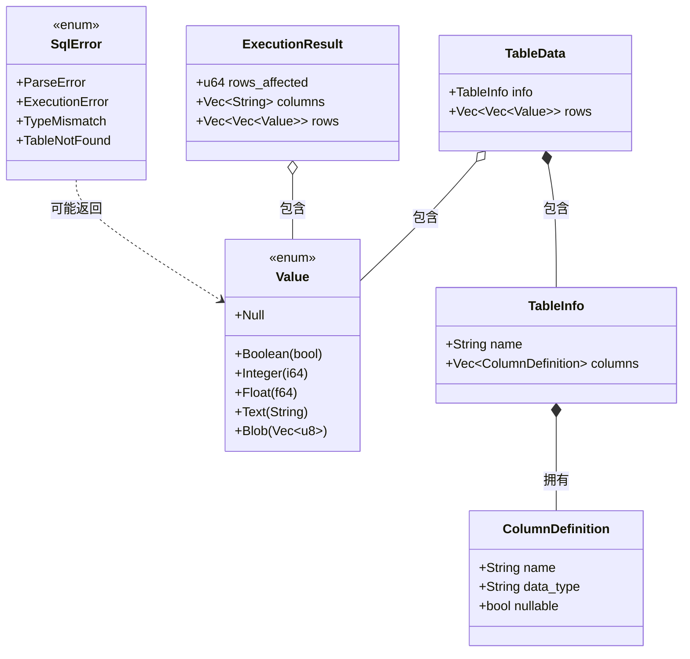
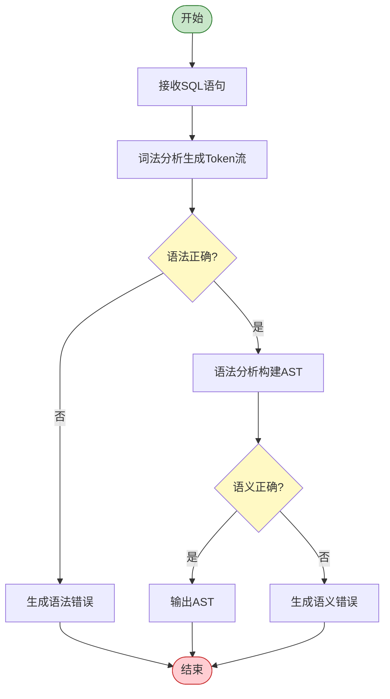
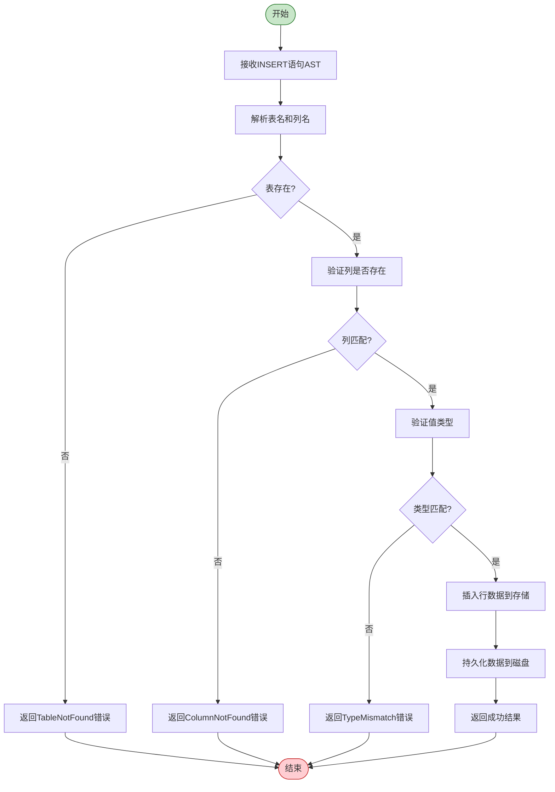
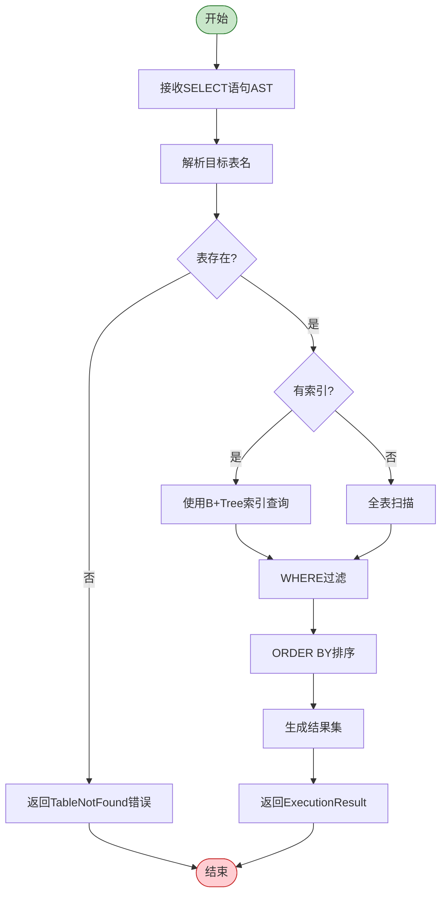
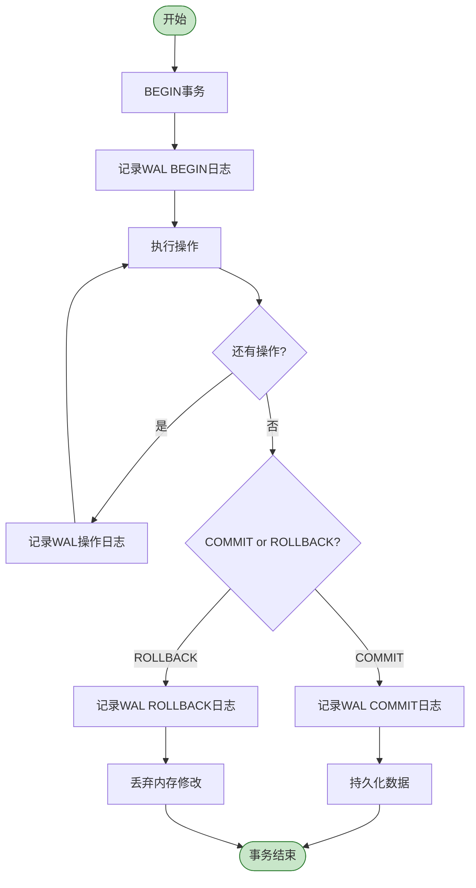

# SQLRustGo 1.0 OOA 分析

## 1. 用例图

### 1.1 Parser 模块用例图

### 1.2 完整系统用例图

---

## 2. 概念类图

### 2.1 Parser 模块概念类图

### 2.2 数据类型概念类图

---

## 3. 活动图

### 3.1 SQL 解析活动图

### 3.2 INSERT 语句执行活动图

### 3.3 SELECT 语句执行活动图

### 3.4 事务执行活动图

---

## 4. 模块职责映射

| 模块 | 用例 | 概念类 | 活动 |
|------|------|--------|------|
| **Lexer** | 词法分析 | SQL语句、词法单元 | 词法分析生成Token流 |
| **Parser** | 语法分析、SQL验证 | 抽象语法树、语法节点、语法错误 | 语法分析构建AST |
| **Executor** | 查询执行、数据CRUD | ExecutionResult | SELECT/INSERT/UPDATE/DELETE执行流程 |
| **Storage** | 表管理、持久化 | TableData、TableInfo、ColumnDefinition、Value | 数据存取和持久化 |
| **Transaction** | 事务管理 | - | 事务执行流程 |
| **Types** | - | Value、SqlError、SqlResult | - |
