# SQLRustGo 1.0 OOD 设计

## 1. 设计类图

### 1.1 Parser 模块设计类图

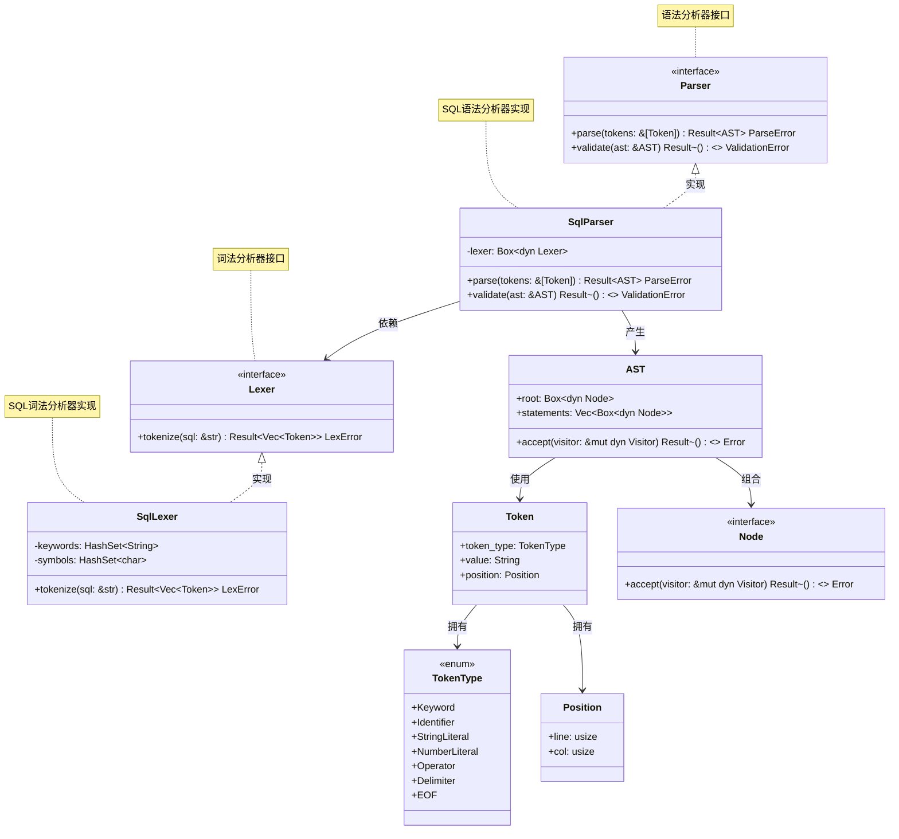

### 1.2 Executor 模块设计类图

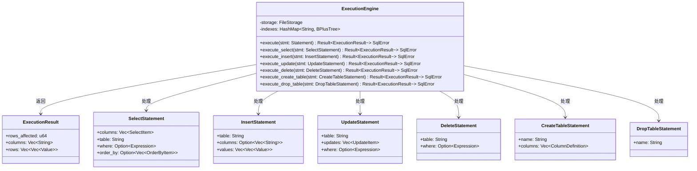

### 1.3 Storage 模块设计类图

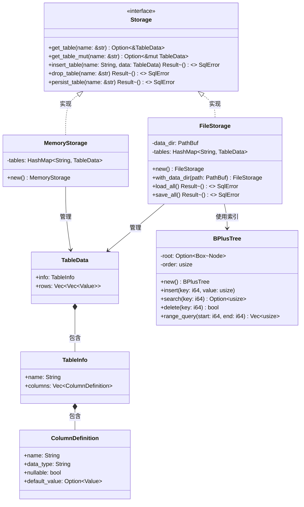

### 1.4 Transaction 模块设计类图

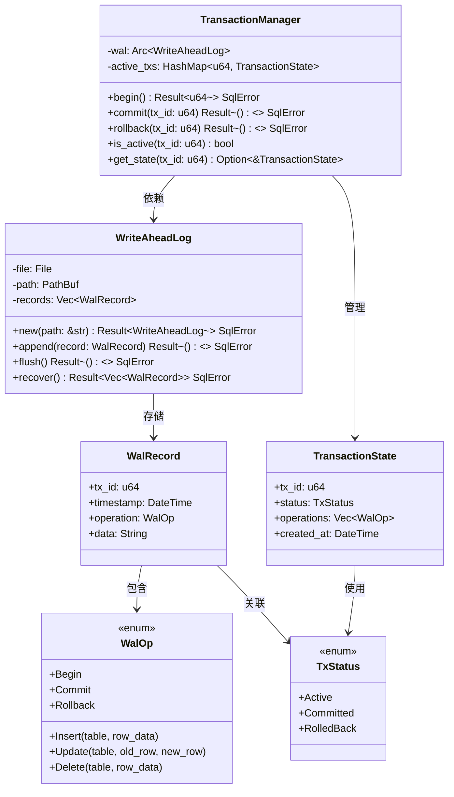

---

## 2. 顺序图

### 2.1 SQL 解析顺序图

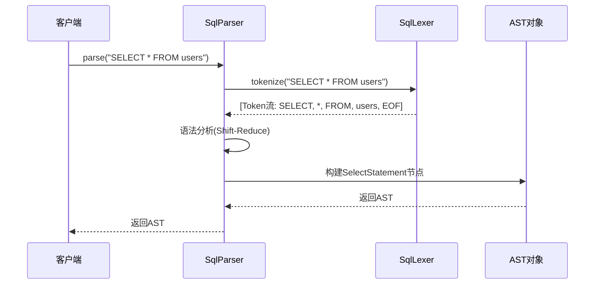

### 2.2 INSERT 执行顺序图

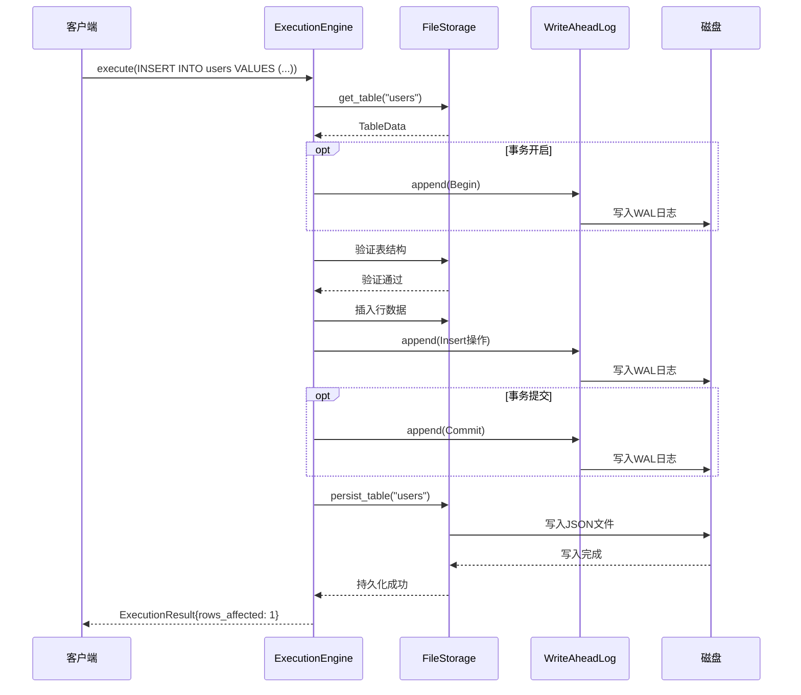

### 2.3 SELECT 执行顺序图（含索引优化）

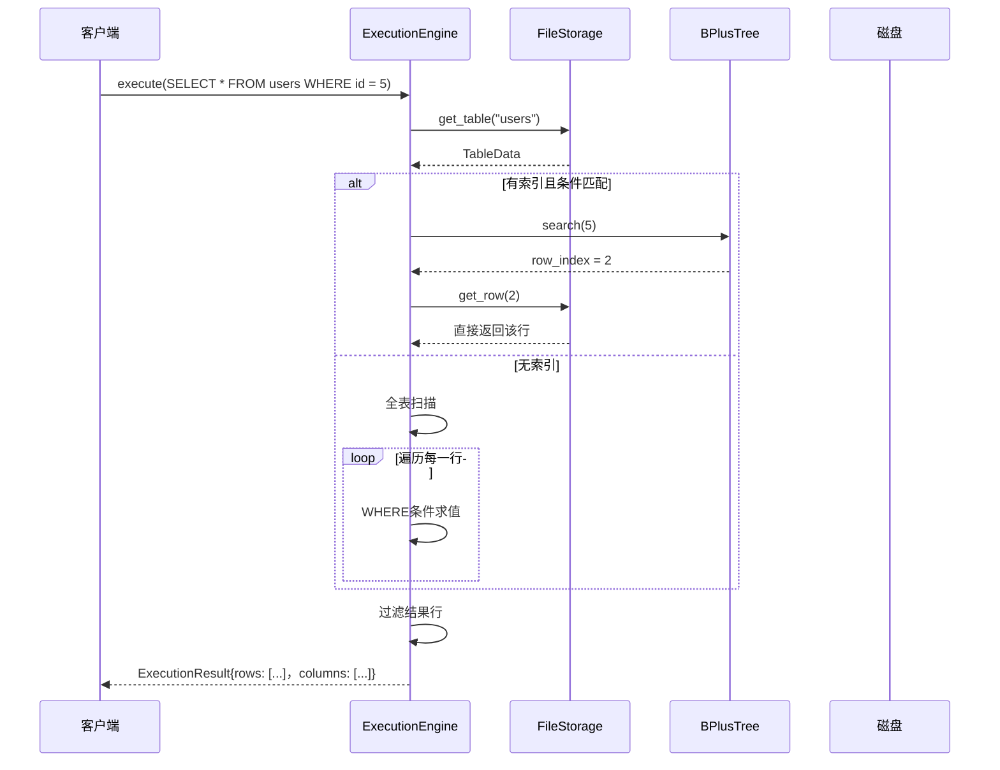

### 2.4 事务提交顺序图

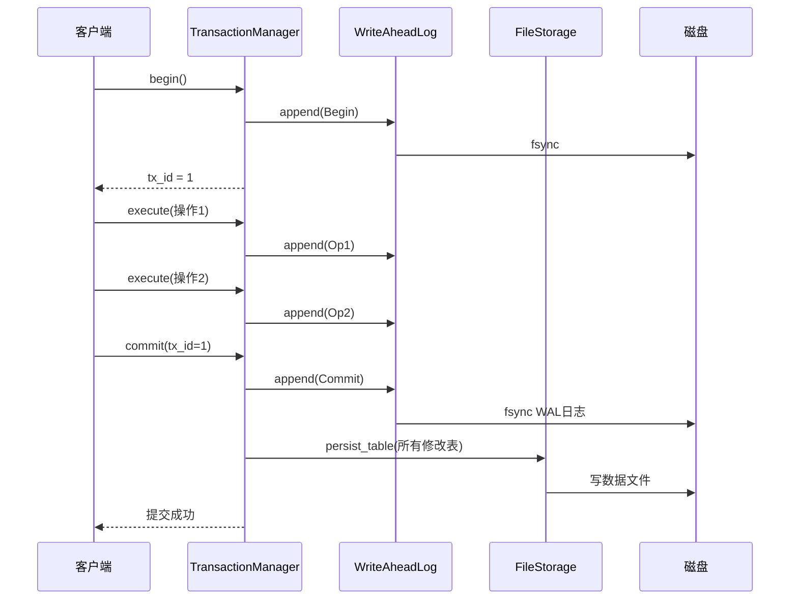

---

## 3. 状态图

### 3.1 解析器状态图

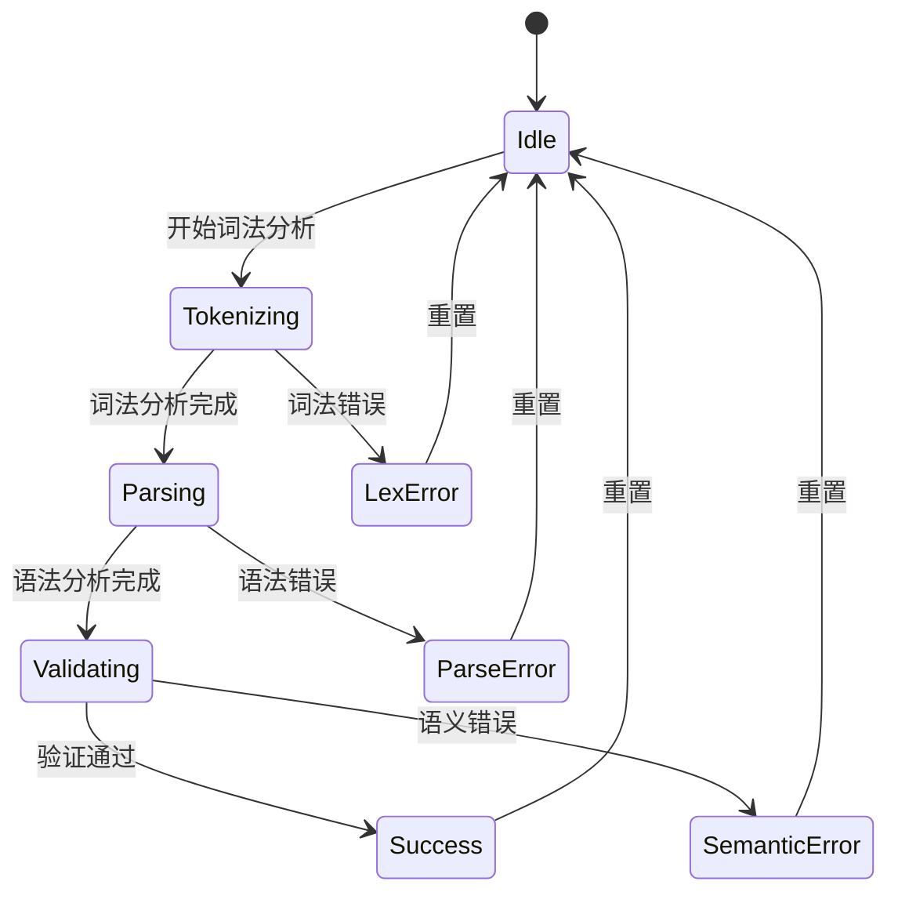

### 3.2 事务状态图

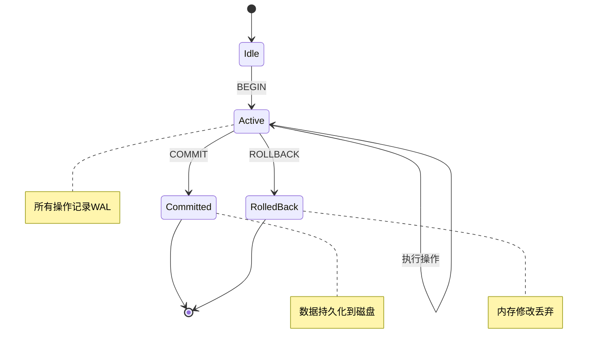

### 3.3 B+树操作状态图

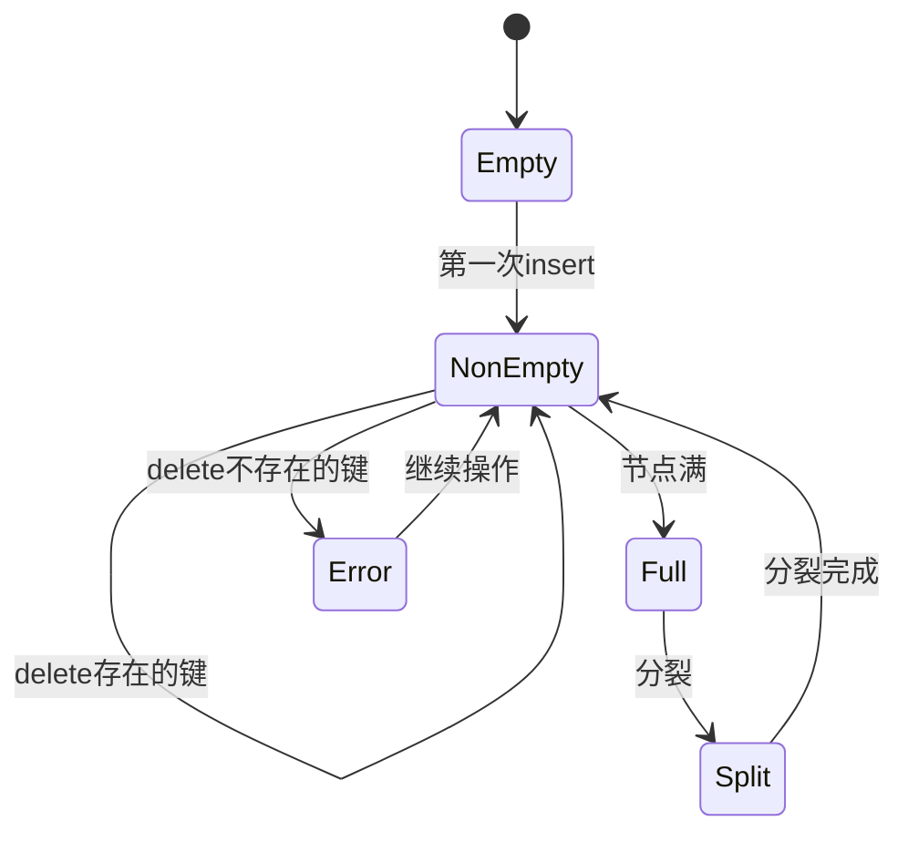

---

## 4. 组件图

### 4.1 系统组件图

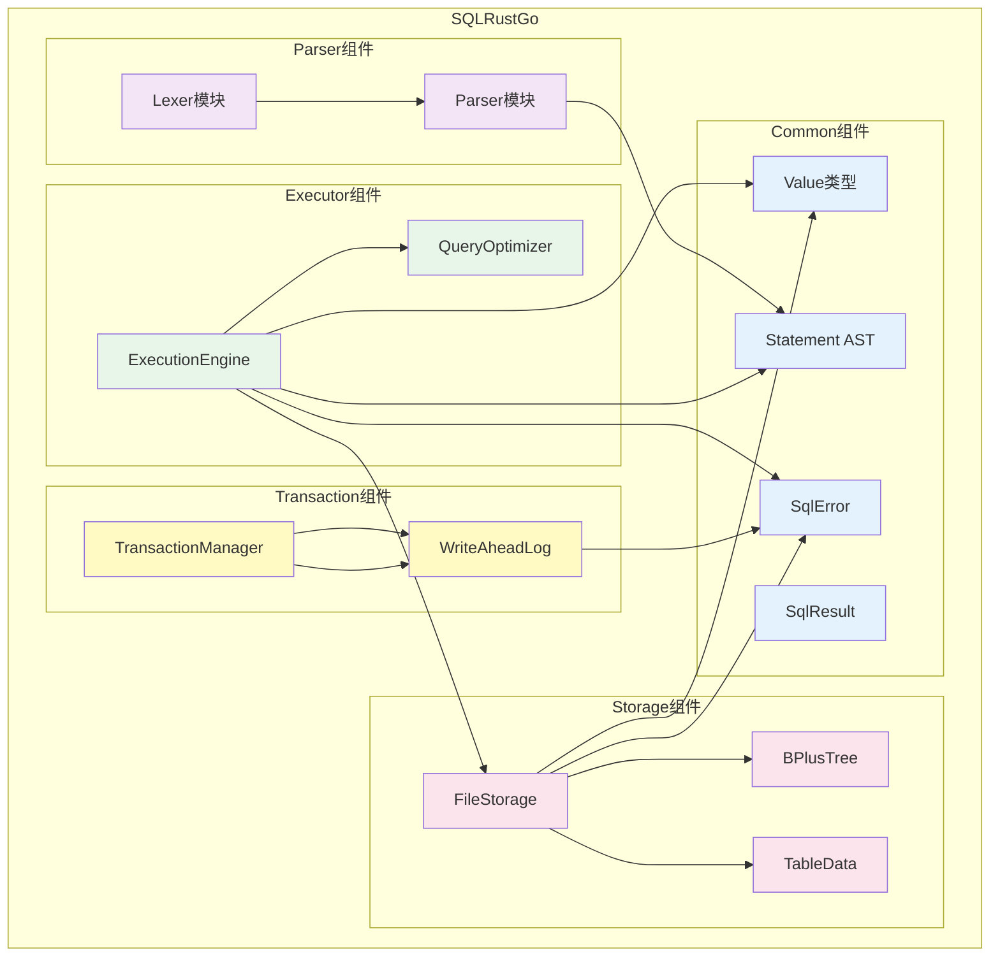

### 4.2 组件依赖关系

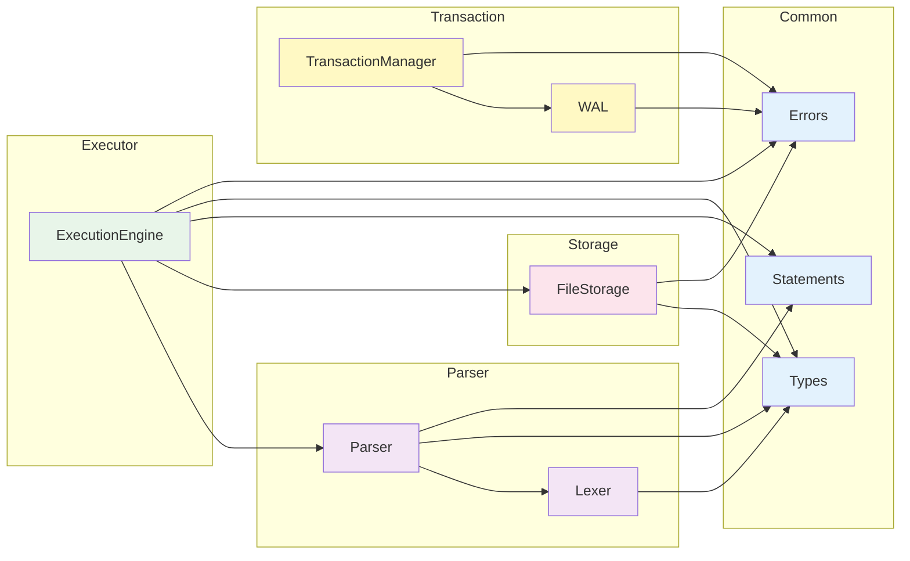

### 4.3 组件职责表

| 组件 | 依赖 | 被依赖 | 职责 |
|------|------|--------|------|
| **Lexer** | Types | Parser | SQL词法分析，生成Token流 |
| **Parser** | Types, Statements | Executor | SQL语法分析，生成AST |
| **Executor** | Parser, Storage, Types, Errors | main | 查询执行引擎 |
| **Storage** | Types, Errors | Executor | 文件存储和持久化 |
| **Transaction** | WAL, Errors | Executor(可选) | 事务管理 |
| **WAL** | Errors | Transaction | 预写日志 |
| **Types** | 无 | 所有组件 | 基础类型定义 |
| **Errors** | 无 | 所有组件 | 错误类型定义 |
| **Statements** | Types | Parser, Executor | AST节点类型 |
