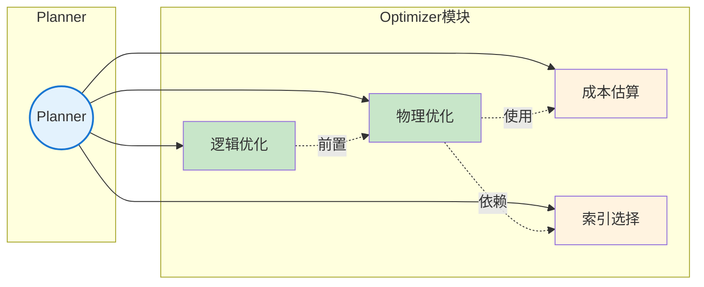
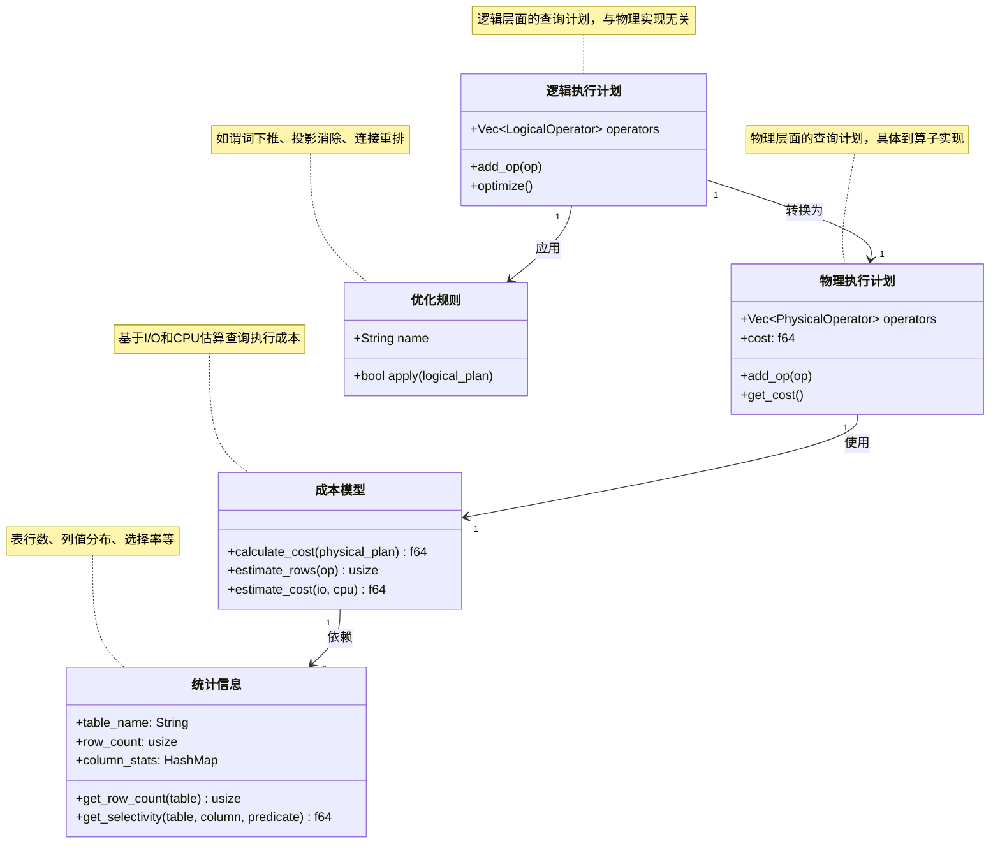
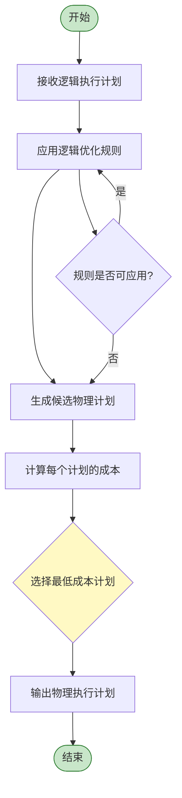
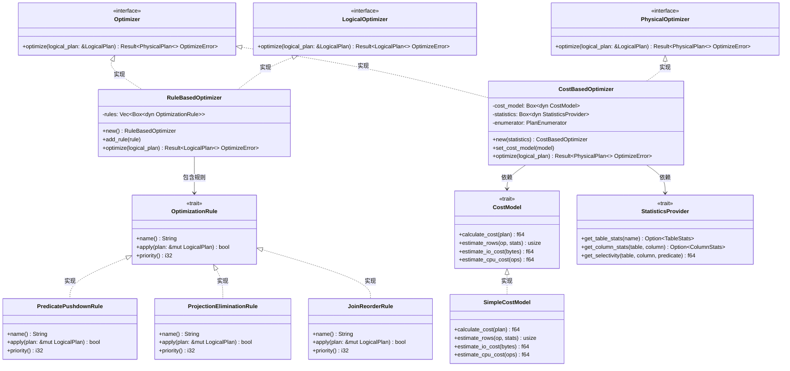
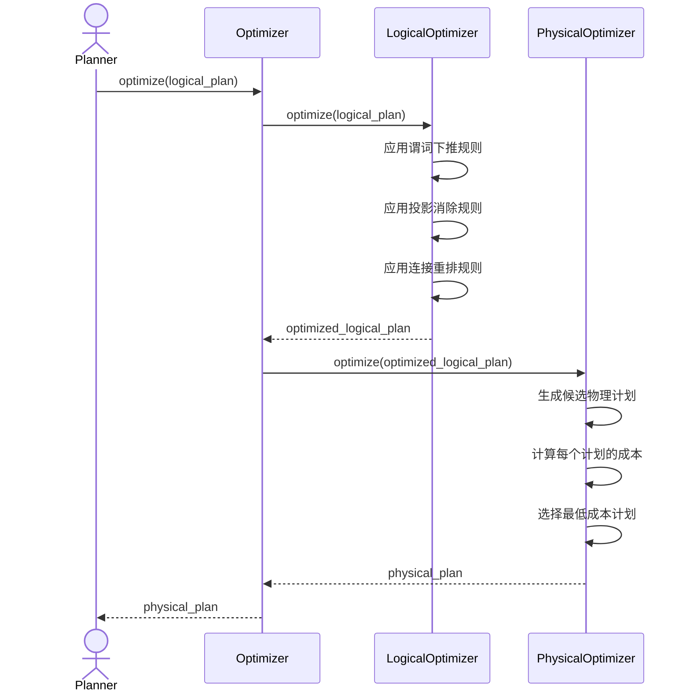
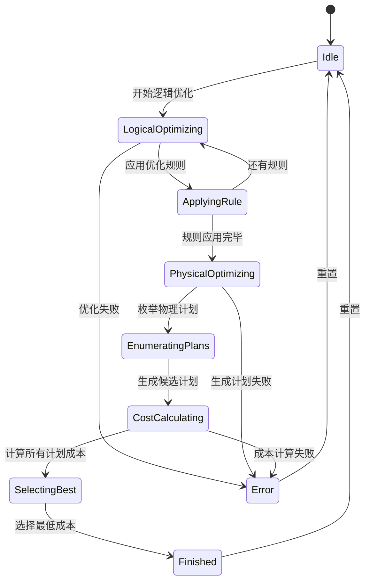
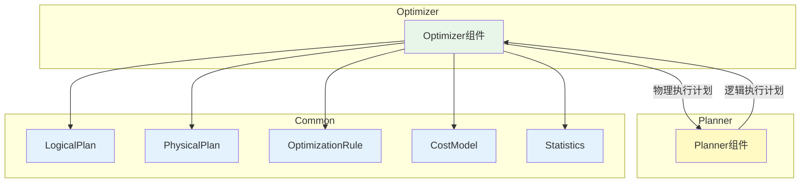
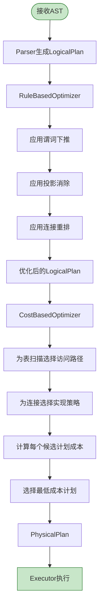
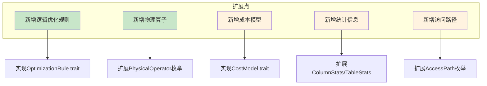

# SQLRustGo 1.0 Optimizer 模块设计

## 一、OOA 分析

### 1. 用例图



### 2. 概念类图



### 3. 活动图



---

## 二、OOD 设计

### 1. 设计类图



### 2. 顺序图



### 3. 状态图



### 4. 组件图



---

## 三、详细设计文档

### 1. 模块概述

Optimizer 模块是 SQLRustGo 的查询优化组件，负责将逻辑执行计划转换为高效的物理执行计划。模块采用两阶段优化架构：先进行逻辑优化（规则优化），再进行物理优化（成本优化）。

**设计目标：**
- 1.0版本：实现规则优化 + 简单成本模型 + 索引选择
- 1.1版本：扩展连接重排、直方图统计信息
- 1.2版本：实现基于代价的连接枚举（动态规划）

### 2. 核心功能

| 功能 | 描述 | 1.0状态 |
|------|------|---------|
| 逻辑优化 | 应用启发式规则改写逻辑计划 | ✅ 实现 |
| 物理优化 | 选择物理算子实现 | ✅ 实现 |
| 成本估算 | 基于I/O和CPU估算执行成本 | ✅ 简单模型 |
| 索引选择 | 选择最优索引访问路径 | ✅ 实现 |
| 谓词下推 | 将WHERE条件下推到数据源 | ✅ 实现 |
| 投影消除 | 移除不必要的列 | ✅ 实现 |
| 连接重排 | 调整连接顺序减少中间结果 | ⚠️ 部分实现 |
| 统计信息 | 表行数、列分布等 | ⚠️ 基础实现 |

### 3. 类与接口设计

#### 3.1 核心接口

```rust
pub trait Optimizer {
    fn optimize(&self, logical_plan: &LogicalPlan) -> SqlResult<PhysicalPlan>;
}

pub trait LogicalOptimizer {
    fn optimize(&self, plan: &LogicalPlan) -> SqlResult<LogicalPlan>;
    fn add_rule(&mut self, rule: Box<dyn OptimizationRule>);
}

pub trait PhysicalOptimizer {
    fn optimize(&self, plan: &LogicalPlan) -> SqlResult<PhysicalPlan>;
    fn set_cost_model(&mut self, model: Box<dyn CostModel>);
}

pub trait OptimizationRule {
    fn name(&self) -> &str;
    fn apply(&self, plan: &mut LogicalPlan) -> bool;
    fn priority(&self) -> i32 { 50 }
}

pub trait CostModel {
    fn calculate_cost(&self, plan: &PhysicalPlan) -> f64;
    fn estimate_rows(&self, op: &PhysicalOperator, stats: &StatisticsProvider) -> usize;
    fn estimate_io_cost(&self, bytes: u64) -> f64 { bytes as f64 * 0.001 }
    fn estimate_cpu_cost(&self, ops: u64) -> f64 { ops as f64 * 0.0001 }
}

pub trait StatisticsProvider {
    fn get_table_stats(&self, name: &str) -> Option<TableStats>;
    fn get_column_stats(&self, table: &str, column: &str) -> Option<ColumnStats>;
    fn get_selectivity(&self, table: &str, column: &str, predicate: &Predicate) -> f64;
}
```

#### 3.2 数据结构

```rust
pub struct LogicalPlan {
    pub operators: Vec<LogicalOperator>,
    pub root_idx: usize,
}

pub enum LogicalOperator {
    TableScan { table: String, projection: Vec<String> },
    Filter { predicate: Predicate, child_idx: usize },
    Project { columns: Vec<String>, child_idx: usize },
    Join { join_type: JoinType, left_idx: usize, right_idx: usize, on: Predicate },
    Aggregate { group_by: Vec<String>, child_idx: usize },
    Limit { limit: usize, offset: usize, child_idx: usize },
}

pub struct PhysicalPlan {
    pub operators: Vec<PhysicalOperator>,
    pub root_idx: usize,
    pub total_cost: f64,
}

pub enum PhysicalOperator {
    TableScan { table: String, projection: Vec<String>, access_path: AccessPath },
    IndexScan { table: String, index: String, key_range: KeyRange, projection: Vec<String> },
    Filter { predicate: Predicate, child_idx: usize, estimated_rows: usize },
    Project { columns: Vec<String>, child_idx: usize },
    NestedLoopJoin { left_idx: usize, right_idx: usize, on: Predicate, estimated_rows: usize },
    HashJoin { left_idx: usize, right_idx: usize, on: String, estimated_rows: usize },
    Aggregate { group_by: Vec<String>, child_idx: usize, estimated_rows: usize },
    Limit { limit: usize, offset: usize, child_idx: usize },
}

pub enum AccessPath {
    FullTableScan,
    IndexOnly { index: String },
    IndexScan { index: String, condition: Predicate },
}

pub enum JoinType {
    Inner,
    Left,
    Right,
    Full,
}

pub enum Predicate {
    Compare { left: Box<Predicate>, op: CompareOp, right: Box<Predicate> },
    And(Vec<Predicate>),
    Or(Vec<Predicate>),
    Column(String),
    Value(Value),
    IsNull(Box<Predicate>),
}

pub enum CompareOp { Eq, Neq, Lt, Le, Gt, Ge, Like, In }

pub struct TableStats {
    pub row_count: usize,
    pub size_bytes: u64,
}

pub struct ColumnStats {
    pub distinct_count: usize,
    pub null_count: usize,
    pub min_value: Option<Value>,
    pub max_value: Option<Value>,
}
```

#### 3.3 实现类

```rust
pub struct RuleBasedOptimizer {
    rules: Vec<Box<dyn OptimizationRule>>,
}

pub struct CostBasedOptimizer {
    cost_model: Box<dyn CostModel>,
    statistics: Box<dyn StatisticsProvider>,
}

pub struct SimpleCostModel;

pub struct BasicStatistics {
    table_stats: HashMap<String, TableStats>,
    column_stats: HashMap<String, HashMap<String, ColumnStats>>,
}

pub struct PredicatePushdownRule;
pub struct ProjectionEliminationRule;
pub struct JoinReorderRule;
```

### 4. 执行流程



### 5. 优化策略

#### 5.1 逻辑优化规则

| 规则 | 优先级 | 描述 | 示例 |
|------|--------|------|------|
| 谓词下推 | 90 | 将Filter尽量下推到数据源 | `SELECT * FROM t JOIN s ON ... WHERE t.id=1` → 先过滤t再连接 |
| 投影消除 | 80 | 移除不必要的列扫描 | `SELECT a FROM t WHERE b=1` → 只扫描a,b列 |
| 连接重排 | 70 | 小表驱动大表 | 100行表 JOIN 10000行表 → 先100行再10000行 |
| 条件合并 | 60 | 合并多个AND条件 | `WHERE a=1 AND b=2` → 合并为单个Filter |
| 消除冗余 | 50 | 移除重复条件、无用Limit等 |  |

#### 5.2 物理优化策略

| 策略 | 描述 | 成本模型 |
|------|------|----------|
| 全表扫描 | 无索引时的默认访问路径 | 扫描行数 × 行大小 |
| 索引扫描 | 有匹配索引时 | 索引高度 + 扫描叶子页数 |
| 索引唯一扫描 | 等值查询唯一键 | 索引高度 |
| 嵌套循环连接 | 小结果集连接 | 左表行数 × 右表扫描成本 |
| 哈希连接 | 大结果集等值连接 | 建立哈希表 + 探测 |

#### 5.3 成本模型

```
总成本 = Σ(算子成本)
      = Σ(I/O成本 + CPU成本)

I/O成本 = 页面数 × 0.001
CPU成本 = 操作数 × 0.0001

算子成本计算：
- TableScan: row_count × row_size × 0.001
- IndexScan: index_height × 0.001 + leaf_pages × page_size × 0.001
- Filter: estimated_rows × comparison_cost × 0.0001
- NestedLoopJoin: left_rows × (right_access_cost + tuple_build_cost)
- HashJoin: (build_rows + probe_rows) × hash_cost
```

### 6. 性能考虑

| 方面 | 考虑 | 1.0实现 |
|------|------|---------|
| **规则应用顺序** | 按优先级排序，高优先级先执行 | ✅ priority字段控制 |
| **规则幂等性** | 同一规则不应重复产生相同效果 | ✅ apply()返回是否有变化 |
| **计划枚举数量** | 避免爆炸式枚举 | ⚠️ 启发式剪枝 |
| **缓存统计信息** | 避免重复读取统计信息 | ✅ StatisticsProvider内部缓存 |
| **成本模型精度** | 简单模型足以指导1.0 | ✅ SimpleCostModel |
| **延迟优化** | 优化器本身不能太慢 | ✅ O(n)规则应用 + O(k)物理枚举 |
| **可扩展成本模型** | 预留更复杂模型的接口 | ✅ CostModel trait |

### 7. 扩展点



### 8. 1.0版本实现清单

| 序号 | 组件 | 实现内容 | 优先级 |
|------|------|----------|--------|
| 1 | LogicalPlan | AST → 逻辑算子 | P0 |
| 2 | PhysicalPlan | 物理算子结构 | P0 |
| 3 | RuleBasedOptimizer | 规则框架 + 3个规则 | P0 |
| 4 | CostBasedOptimizer | 物理优化框架 | P0 |
| 5 | SimpleCostModel | I/O + CPU估算 | P0 |
| 6 | BasicStatistics | 表行数 + 列基本统计 | P0 |
| 7 | PredicatePushdownRule | WHERE条件下推 | P1 |
| 8 | ProjectionEliminationRule | 列消除 | P1 |
| 9 | JoinReorderRule | 连接重排(启发式) | P2 |
| 10 | 索引选择 | 匹配WHERE条件选择索引 | P1 |
