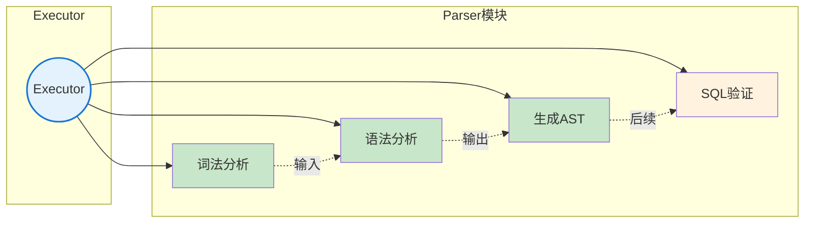
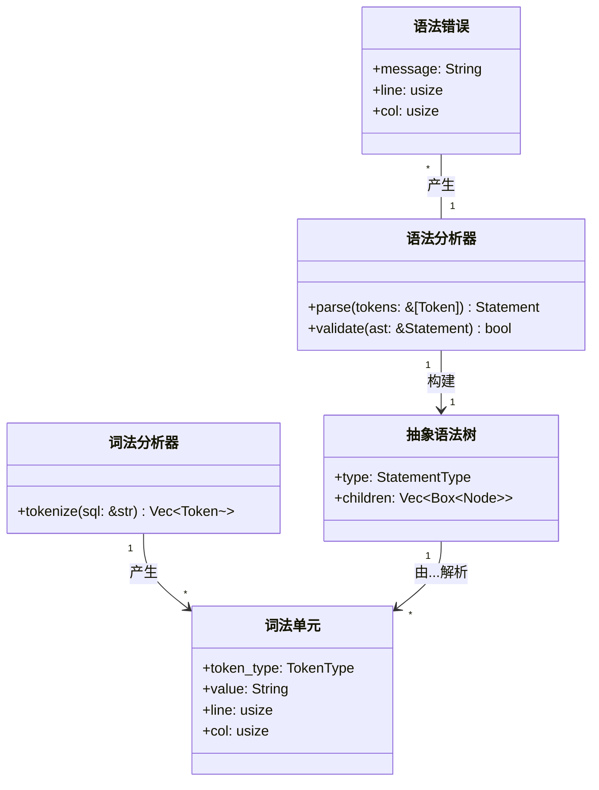
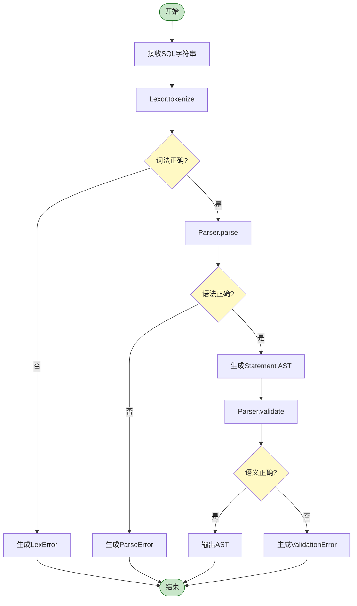
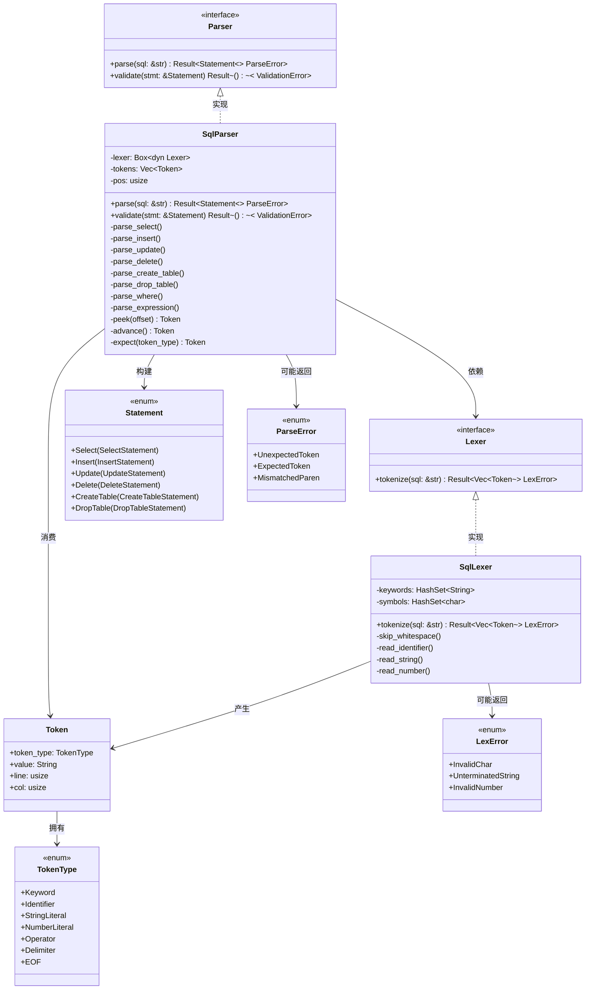
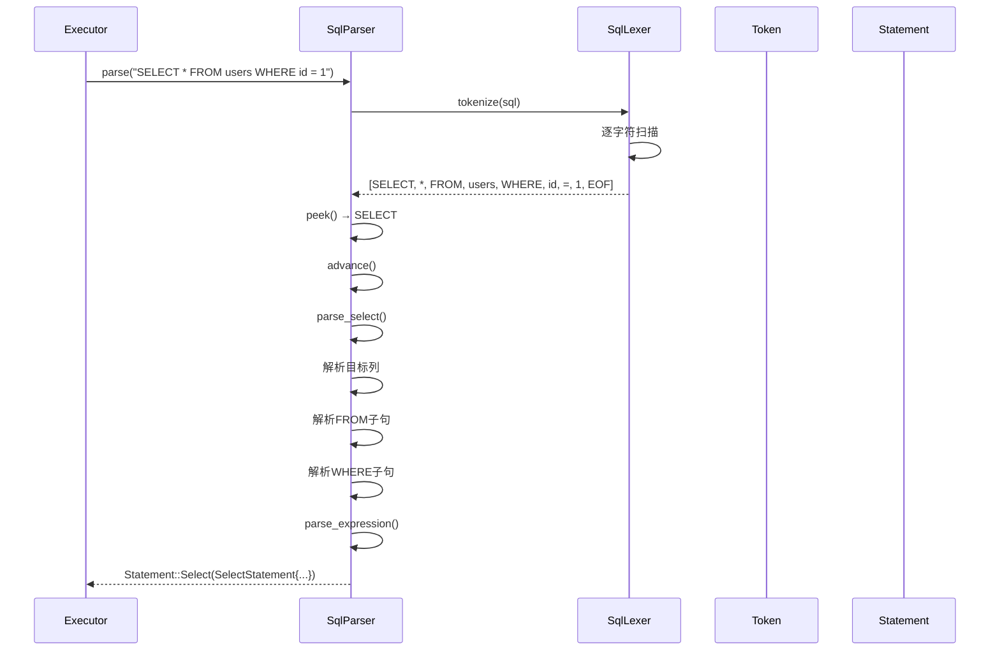
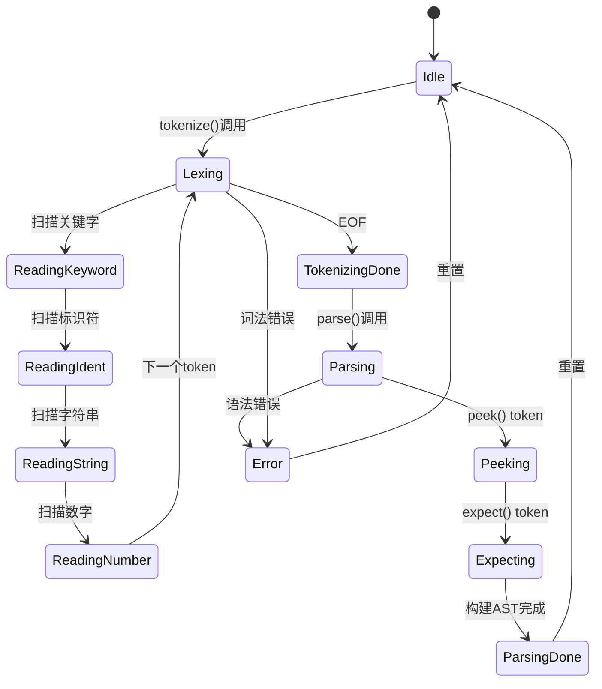
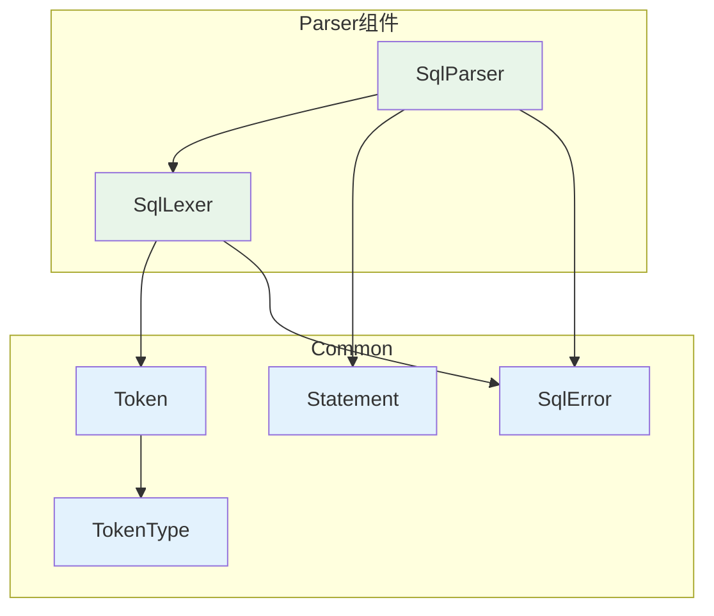
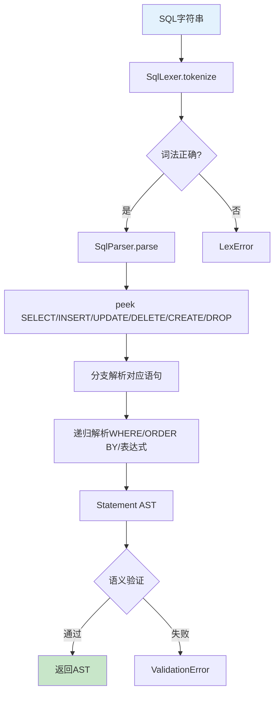

# SQLRustGo 1.0 Parser 模块设计

## 一、OOA 分析

### 1. 用例图



### 2. 概念类图



### 3. 活动图



---

## 二、OOD 设计

### 1. 设计类图



### 2. 顺序图



### 3. 状态图



### 4. 组件图



---

## 三、详细设计文档

### 1. 模块概述

Parser 模块是 SQLRustGo 的 SQL 解析核心，负责将用户输入的 SQL 字符串解析为结构化的 AST（抽象语法树）。模块分为两层：**Lexer（词法分析器）** 将 SQL 分解为 Token 序列，**Parser（语法分析器）** 将 Token 序列组装为 Statement AST。

**设计目标：**
- 1.0版本：支持 CRUD + CREATE/DROP TABLE 基本语句
- 1.1版本：支持 JOIN、GROUP BY、HAVING
- 1.2版本：支持子查询、UNION

### 2. 核心功能

| 功能 | 描述 | 1.0状态 |
|------|------|---------|
| 词法分析 | SQL字符串 → Token序列 | ✅ 实现 |
| 关键字识别 | SELECT/FROM/WHERE等 | ✅ 实现 |
| 标识符识别 | 表名/列名 | ✅ 实现 |
| 字面量识别 | 字符串/数字 | ✅ 实现 |
| 运算符识别 | = < > <= >= != AND OR | ✅ 实现 |
| SELECT解析 | SELECT * FROM t WHERE | ✅ 实现 |
| INSERT解析 | INSERT INTO t VALUES | ✅ 实现 |
| UPDATE解析 | UPDATE t SET WHERE | ✅ 实现 |
| DELETE解析 | DELETE FROM t WHERE | ✅ 实现 |
| CREATE TABLE | CREATE TABLE t(cols) | ✅ 实现 |
| DROP TABLE | DROP TABLE t | ✅ 实现 |
| 表达式解析 | WHERE条件表达式 | ✅ 实现 |
| 语法错误 | 定位+错误信息 | ✅ 实现 |

### 3. 类与接口设计

#### 3.1 Lexer 实现

```rust
pub struct SqlLexer {
    input: Vec<char>,
    pos: usize,
    line: usize,
    col: usize,
    keywords: HashSet<String>,
}

impl SqlLexer {
    pub fn new(sql: &str) -> Self {
        let mut keywords = HashSet::new();
        for kw in ["SELECT", "FROM", "WHERE", "INSERT", "INTO", "VALUES",
                   "UPDATE", "SET", "DELETE", "CREATE", "TABLE", "DROP",
                   "ORDER", "BY", "LIMIT", "OFFSET", "AND", "OR", "NOT",
                   "TRUE", "FALSE", "NULL", "IN", "LIKE", "IS", "GROUP", "HAVING"] {
            keywords.insert(kw.to_string());
        }
        Self { input: sql.chars().collect(), pos: 0, line: 1, col: 1, keywords }
    }
    
    pub fn tokenize(&mut self) -> SqlResult<Vec<Token>> {
        let mut tokens = Vec::new();
        while self.pos < self.input.len() {
            self.skip_whitespace();
            if self.pos >= self.input.len() { break; }
            let c = self.input[self.pos];
            let start_col = self.col;
            let start_line = self.line;
            let token = if c.is_ascii_alphabetic() || c == '_' {
                self.read_identifier(start_line, start_col)?
            } else if c.is_ascii_digit() {
                self.read_number(start_line, start_col)?
            } else if c == '\'' {
                self.read_string(start_line, start_col)?
            } else {
                self.read_operator(start_line, start_col)?
            };
            tokens.push(token);
        }
        tokens.push(Token::new(TokenType::EOF, String::new(), self.line, self.col));
        Ok(tokens)
    }
    
    fn skip_whitespace(&mut self) {
        while self.pos < self.input.len() && self.input[self.pos].is_whitespace() {
            if self.input[self.pos] == '\n' { self.line += 1; self.col = 1; }
            else { self.col += 1; }
            self.pos += 1;
        }
    }
    
    fn read_identifier(&mut self, line: usize, col: usize) -> SqlResult<Token> {
        let start = self.pos;
        while self.pos < self.input.len() && (self.input[self.pos].is_ascii_alphanumeric() || self.input[self.pos] == '_') {
            self.pos += 1;
            self.col += 1;
        }
        let value: String = self.input[start..self.pos].iter().collect();
        let upper = value.to_uppercase();
        let token_type = if self.keywords.contains(&upper) {
            TokenType::Keyword(upper)
        } else {
            TokenType::Identifier(value)
        };
        Ok(Token::new(token_type, value, line, col))
    }
    
    fn read_string(&mut self, line: usize, col: usize) -> SqlResult<Token> {
        self.pos += 1;
        self.col += 1;
        let start = self.pos;
        while self.pos < self.input.len() && self.input[self.pos] != '\'' {
            if self.input[self.pos] == '\n' { self.line += 1; self.col = 1; }
            self.pos += 1;
        }
        if self.pos >= self.input.len() {
            return Err(SqlError::LexerError(format!("Unterminated string at line {}", line)));
        }
        let value: String = self.input[start..self.pos].iter().collect();
        self.pos += 1;
        self.col += 1;
        Ok(Token::new(TokenType::StringLiteral, value, line, col))
    }
    
    fn read_number(&mut self, line: usize, col: usize) -> SqlResult<Token> {
        let start = self.pos;
        while self.pos < self.input.len() && (self.input[self.pos].is_ascii_digit() || self.input[self.pos] == '.') {
            self.pos += 1;
            self.col += 1;
        }
        let value: String = self.input[start..self.pos].iter().collect();
        let token_type = if value.contains('.') {
            TokenType::NumberLiteral(value.parse::<f64>().unwrap_or(0.0))
        } else {
            TokenType::NumberLiteral(value.parse::<i64>().unwrap_or(0))
        };
        Ok(Token::new(token_type, value, line, col))
    }
    
    fn read_operator(&mut self, line: usize, col: usize) -> SqlResult<Token> {
        let c = self.input[self.pos];
        self.pos += 1;
        self.col += 1;
        let op_str = match c {
            '=' if self.pos < self.input.len() && self.input[self.pos] == '=' => { self.pos += 1; self.col += 1; "==".to_string() }
            '!' if self.pos < self.input.len() && self.input[self.pos] == '=' => { self.pos += 1; self.col += 1; "!=".to_string() }
            '<' if self.pos < self.input.len() && self.input[self.pos] == '=' => { self.pos += 1; self.col += 1; "<=".to_string() }
            '>' if self.pos < self.input.len() && self.input[self.pos] == '=' => { self.pos += 1; self.col += 1; ">=".to_string() }
            c => c.to_string(),
        };
        let token_type = match op_str.as_str() {
            "," | "(" | ")" | ";" | "." => TokenType::Delimiter(op_str),
            _ => TokenType::Operator(op_str),
        };
        Ok(Token::new(token_type, op_str, line, col))
    }
}
```

#### 3.2 Parser 实现

```rust
pub struct SqlParser {
    tokens: Vec<Token>,
    pos: usize,
}

impl SqlParser {
    pub fn new(sql: &str) -> SqlResult<Self> {
        let mut lexer = SqlLexer::new(sql);
        let tokens = lexer.tokenize()?;
        Ok(Self { tokens, pos: 0 })
    }
    
    pub fn parse(&mut self) -> SqlResult<Statement> {
        let token = self.advance();
        match &token.token_type {
            TokenType::Keyword(kw) => match kw.as_str() {
                "SELECT" => self.parse_select(),
                "INSERT" => self.parse_insert(),
                "UPDATE" => self.parse_update(),
                "DELETE" => self.parse_delete(),
                "CREATE" => self.parse_create(),
                "DROP" => self.parse_drop(),
                _ => Err(SqlError::ParserError(format!("Unexpected keyword: {}", kw))),
            },
            _ => Err(SqlError::ParserError(format!("Expected keyword, got {:?}", token.token_type))),
        }
    }
    
    fn parse_select(&mut self) -> SqlResult<Statement> {
        let mut columns = Vec::new();
        if self.peek_is_identifier() || self.peek_is_star() {
            loop {
                let t = self.advance();
                if matches!(t.token_type, TokenType::Operator(ref op) if op == "*") {
                    columns.push(SelectItem::All);
                } else if let TokenType::Identifier(name) = t.token_type {
                    let mut col_name = name;
                    if self.peek_is_dot() {
                        self.advance();
                        if let TokenType::Identifier(cn) = self.advance().token_type {
                            col_name = format!("{}.{}", col_name, cn);
                        }
                    }
                    columns.push(SelectItem::Column(col_name));
                }
                if !self.peek_is_comma() { break; }
                self.advance();
            }
        }
        
        self.expect_keyword("FROM")?;
        let table_name = self.expect_identifier()?;
        
        let mut where_clause = None;
        if self.peek_is_keyword("WHERE") {
            self.advance();
            where_clause = Some(self.parse_expression()?);
        }
        
        let mut order_by = None;
        if self.peek_is_keyword("ORDER") {
            self.advance();
            self.expect_keyword("BY")?;
            let col = self.expect_identifier()?;
            let mut asc = true;
            if self.peek_is_keyword("DESC") { self.advance(); asc = false; }
            else if self.peek_is_keyword("ASC") { self.advance(); }
            order_by = Some(OrderByItem { column: col, asc });
        }
        
        Ok(Statement::Select(SelectStatement { columns, table: table_name, where_clause, order_by }))
    }
    
    fn parse_insert(&mut self) -> SqlResult<Statement> {
        self.expect_keyword("INTO")?;
        let table_name = self.expect_identifier()?;
        
        let mut columns = None;
        if self.peek_is_lparen() {
            self.advance();
            let mut cols = Vec::new();
            loop {
                cols.push(self.expect_identifier()?);
                if !self.peek_is_comma() { break; }
                self.advance();
            }
            self.expect_rparen()?;
            columns = Some(cols);
        }
        
        self.expect_keyword("VALUES")?;
        let mut values = Vec::new();
        self.expect_lparen()?;
        loop {
            values.push(self.parse_value()?);
            if !self.peek_is_comma() { break; }
            self.advance();
        }
        self.expect_rparen()?;
        
        Ok(Statement::Insert(InsertStatement { table: table_name, columns, values: vec![values] }))
    }
    
    fn parse_update(&mut self) -> SqlResult<Statement> {
        let table_name = self.expect_identifier()?;
        self.expect_keyword("SET")?;
        let mut updates = Vec::new();
        loop {
            let col = self.expect_identifier()?;
            self.expect_operator("=")?;
            let val = self.parse_value()?;
            updates.push(UpdateItem { column: col, value: val });
            if !self.peek_is_comma() { break; }
            self.advance();
        }
        let mut where_clause = None;
        if self.peek_is_keyword("WHERE") {
            self.advance();
            where_clause = Some(self.parse_expression()?);
        }
        Ok(Statement::Update(UpdateStatement { table: table_name, updates, where_clause }))
    }
    
    fn parse_delete(&mut self) -> SqlResult<Statement> {
        self.expect_keyword("FROM")?;
        let table_name = self.expect_identifier()?;
        let mut where_clause = None;
        if self.peek_is_keyword("WHERE") {
            self.advance();
            where_clause = Some(self.parse_expression()?);
        }
        Ok(Statement::Delete(DeleteStatement { table: table_name, where_clause }))
    }
    
    fn parse_create(&mut self) -> SqlResult<Statement> {
        self.expect_keyword("TABLE")?;
        let table_name = self.expect_identifier()?;
        self.expect_lparen()?;
        let mut columns = Vec::new();
        loop {
            let name = self.expect_identifier()?;
            let type_tok = self.advance();
            let data_type = match type_tok.token_type {
                TokenType::Keyword(ref k) => k.clone(),
                TokenType::Identifier(ref i) => i.clone(),
                _ => return Err(SqlError::ParserError(format!("Expected type, got {:?}", type_tok.token_type))),
            };
            let mut nullable = true;
            if self.peek_is_keyword("NOT") {
                self.advance();
                self.expect_keyword("NULL")?;
                nullable = false;
            } else if self.peek_is_keyword("NULL") {
                self.advance();
            }
            columns.push(ColumnDefinition { name, data_type, nullable, default_value: None, is_primary_key: false });
            if !self.peek_is_comma() { break; }
            self.advance();
        }
        self.expect_rparen()?;
        Ok(Statement::CreateTable(CreateTableStatement { name: table_name, columns }))
    }
    
    fn parse_drop(&mut self) -> SqlResult<Statement> {
        self.expect_keyword("TABLE")?;
        let table_name = self.expect_identifier()?;
        Ok(Statement::DropTable(DropTableStatement { name: table_name }))
    }
    
    fn parse_expression(&mut self) -> SqlResult<Predicate> {
        let mut left = self.parse_simple_expr()?;
        while self.pos < self.tokens.len() - 1 {
            let peek = &self.tokens[self.pos];
            let is_and = matches!(&peek.token_type, TokenType::Keyword(k) if k == "AND");
            let is_or = matches!(&peek.token_type, TokenType::Keyword(k) if k == "OR");
            if is_and || is_or {
                self.advance();
                let right = self.parse_simple_expr()?;
                let op = if is_and { LogicalOp::And } else { LogicalOp::Or };
                left = Predicate::Logical(Box::new(left), op, Box::new(right));
            } else { break; }
        }
        Ok(left)
    }
    
    fn parse_simple_expr(&mut self) -> SqlResult<Predicate> {
        let mut left_val = self.parse_operand()?;
        let op_tok = self.advance();
        let cmp_op = match &op_tok.token_type {
            TokenType::Operator(op) => match op.as_str() {
                "=" => CompareOp::Eq, "!=" | "<>" => CompareOp::Neq,
                "<" => CompareOp::Lt, "<=" => CompareOp::Le,
                ">" => CompareOp::Gt, ">=" => CompareOp::Ge,
                _ => return Err(SqlError::ParserError(format!("Invalid operator: {}", op))),
            },
            _ => return Err(SqlError::ParserError(format!("Expected operator, got {:?}", op_tok.token_type))),
        };
        let right_val = self.parse_operand()?;
        Ok(Predicate::Compare(left_val, cmp_op, right_val))
    }
    
    fn parse_operand(&mut self) -> SqlResult<Expression> {
        let tok = self.advance();
        match tok.token_type {
            TokenType::Identifier(name) => Ok(Expression::Column(name)),
            TokenType::StringLiteral(s) => Ok(Expression::Value(Value::Text(s))),
            TokenType::NumberLiteral(n) => {
                if n.fract() == 0.0 { Ok(Expression::Value(Value::Integer(n as i64))) }
                else { Ok(Expression::Value(Value::Float(n))) }
            }
            TokenType::Keyword(kw) => match kw.as_str() {
                "NULL" => Ok(Expression::Value(Value::Null)),
                "TRUE" => Ok(Expression::Value(Value::Boolean(true))),
                "FALSE" => Ok(Expression::Value(Value::Boolean(false))),
                _ => Err(SqlError::ParserError(format!("Unexpected keyword in expression: {}", kw))),
            },
            _ => Err(SqlError::ParserError(format!("Expected operand, got {:?}", tok.token_type))),
        }
    }
    
    fn parse_value(&mut self) -> SqlResult<Value> {
        let tok = self.advance();
        match tok.token_type {
            TokenType::StringLiteral(s) => Ok(Value::Text(s)),
            TokenType::NumberLiteral(n) => {
                if n.fract() == 0.0 { Ok(Value::Integer(n as i64)) }
                else { Ok(Value::Float(n)) }
            }
            TokenType::Keyword(kw) => match kw.as_str() {
                "NULL" => Ok(Value::Null),
                "TRUE" => Ok(Value::Boolean(true)),
                "FALSE" => Ok(Value::Boolean(false)),
                _ => Err(SqlError::ParserError(format!("Unexpected keyword: {}", kw))),
            },
            _ => Err(SqlError::ParserError(format!("Expected value, got {:?}", tok.token_type))),
        }
    }
    
    fn peek(&self) -> &Token { &self.tokens[self.pos] }
    fn advance(&mut self) -> Token { let t = self.tokens[self.pos].clone(); self.pos += 1; t }
    fn peek_is_identifier(&self) { matches!(&self.tokens[self.pos].token_type, TokenType::Identifier(_)) }
    fn peek_is_star(&self) { matches!(&self.tokens[self.pos].token_type, TokenType::Operator(ref op) if op == "*") }
    fn peek_is_comma(&self) { matches!(&self.tokens[self.pos].token_type, TokenType::Delimiter(ref d) if d == ",") }
    fn peek_is_dot(&self) { matches!(&self.tokens[self.pos].token_type, TokenType::Delimiter(ref d) if d == ".") }
    fn peek_is_lparen(&self) { matches!(&self.tokens[self.pos].token_type, TokenType::Delimiter(ref d) if d == "(") }
    fn peek_is_rparen(&self) { matches!(&self.tokens[self.pos].token_type, TokenType::Delimiter(ref d) if d == ")") }
    fn peek_is_keyword(&self, kw: &str) { matches!(&self.tokens[self.pos].token_type, TokenType::Keyword(k) if k == kw) }
}
```

### 4. 执行流程



### 5. 性能考虑

| 方面 | 考虑 | 1.0实现 |
|------|------|---------|
| **Lexer单次扫描** | 单遍扫描生成所有Token | ✅ 实现 |
| **Parser递归下降** | 递归下降解析器 | ✅ 实现 |
| **错误定位** | line+col精确位置 | ✅ 实现 |
| **关键字预定义** | HashSet快速查找 | ✅ 实现 |
| **SQL注入防护** | 字符串字面量转义 | ⚠️ 需增强 |
| **Unicode支持** | 标识符支持UTF-8 | ⚠️ 基础支持 |
| **注释忽略** | SQL注释--和/* */ | ❌ 1.1版本 |
| **多语句** | 分号分隔多SQL | ❌ 1.1版本 |

### 6. 1.0版本实现清单

| 序号 | 组件 | 实现内容 | 优先级 |
|------|------|----------|--------|
| 1 | SqlLexer | 词法分析器核心 | P0 |
| 2 | Token / TokenType | Token结构 | P0 |
| 3 | SqlParser | 递归下降解析器 | P0 |
| 4 | SELECT解析 | SELECT+FROM+WHERE+ORDER BY | P0 |
| 5 | INSERT解析 | INSERT INTO...VALUES | P0 |
| 6 | UPDATE解析 | UPDATE...SET...WHERE | P0 |
| 7 | DELETE解析 | DELETE FROM...WHERE | P0 |
| 8 | CREATE TABLE | CREATE TABLE... | P0 |
| 9 | DROP TABLE | DROP TABLE... | P0 |
| 10 | 表达式解析 | 比较运算+逻辑运算 | P0 |
| 11 | 错误定位 | 行号+列号 | P1 |
| 12 | 类型转换 | INTEGER/TEXT/BOOLEAN | P1 |
