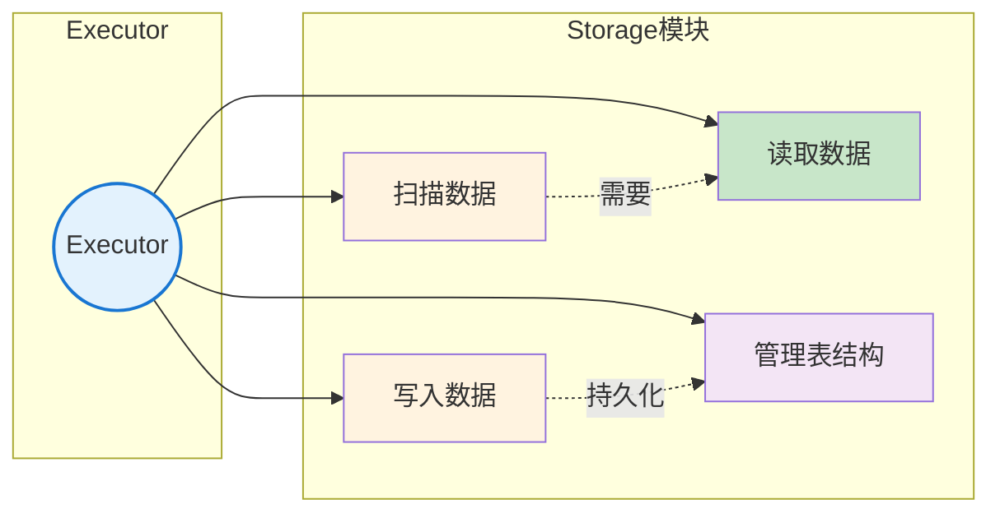
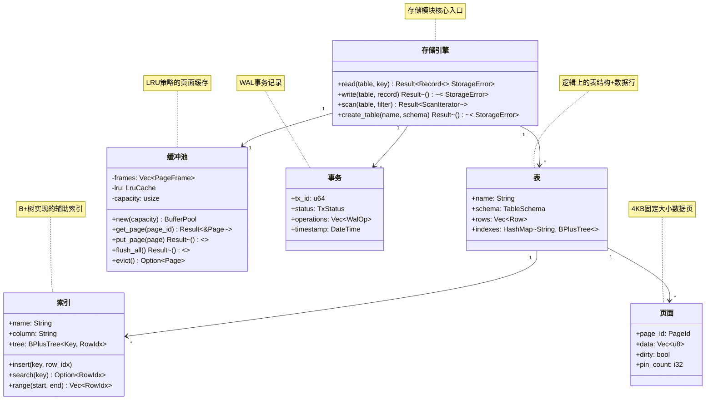
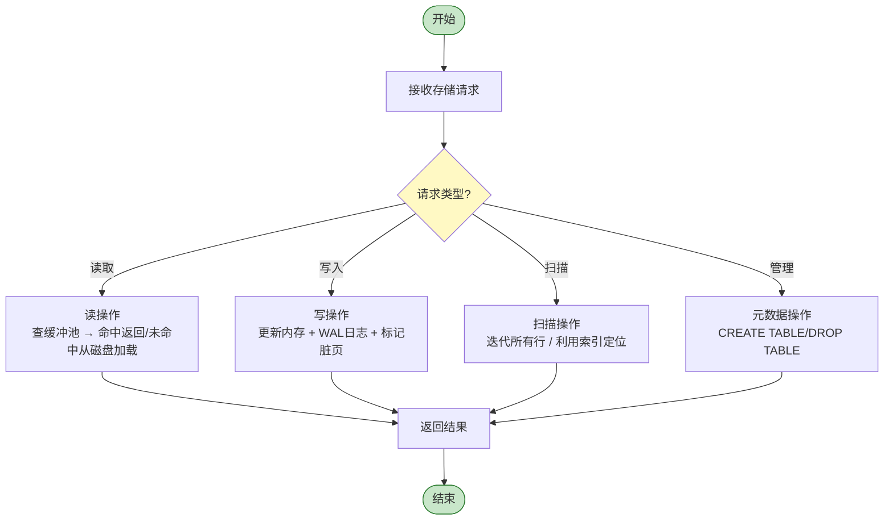
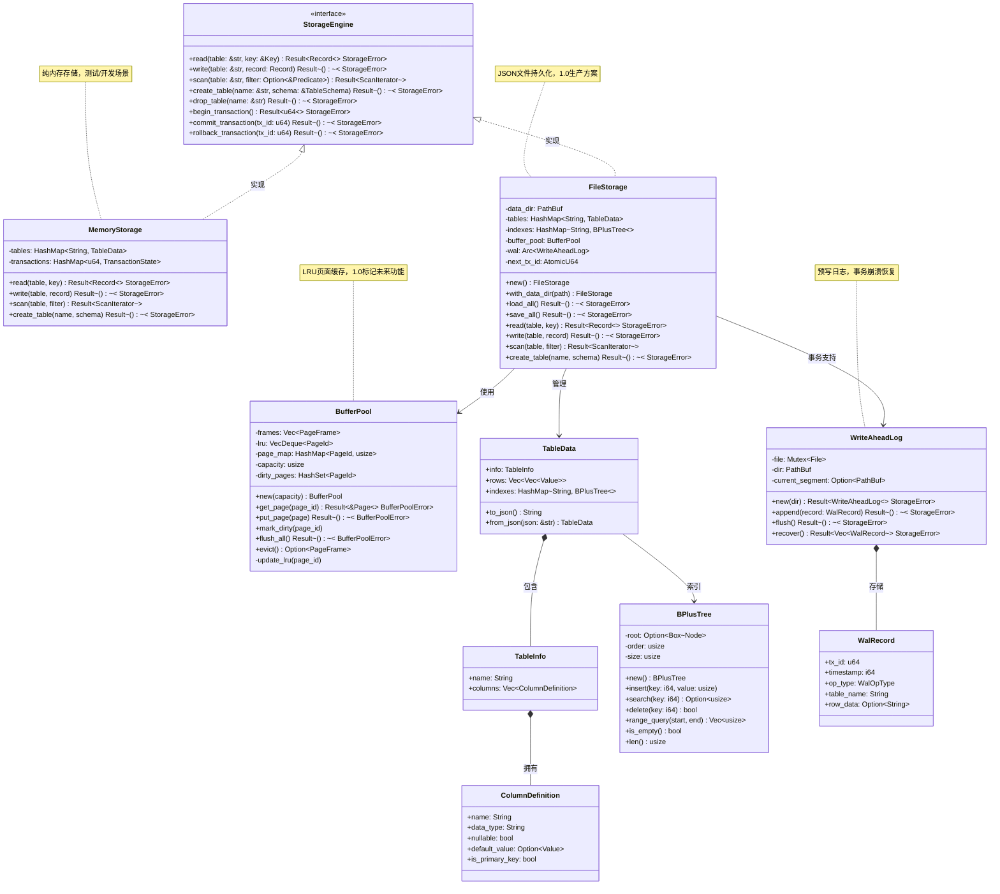
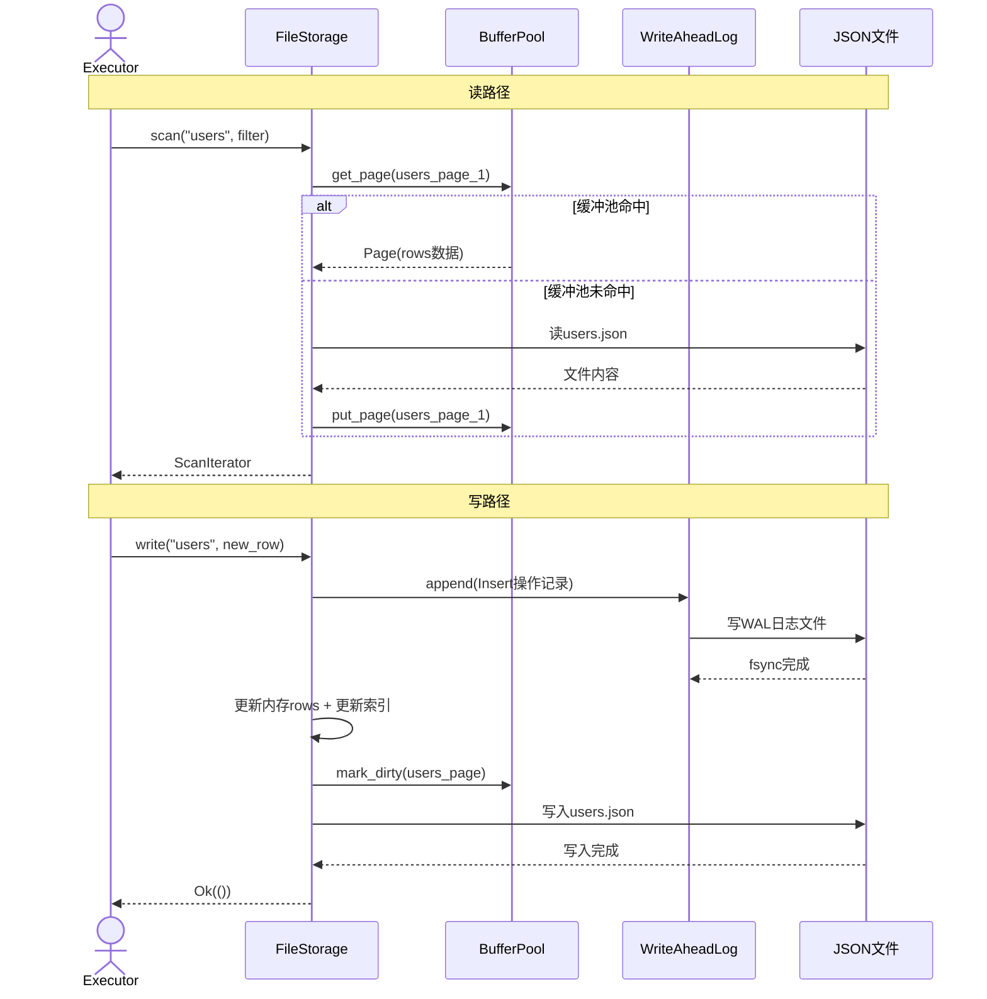
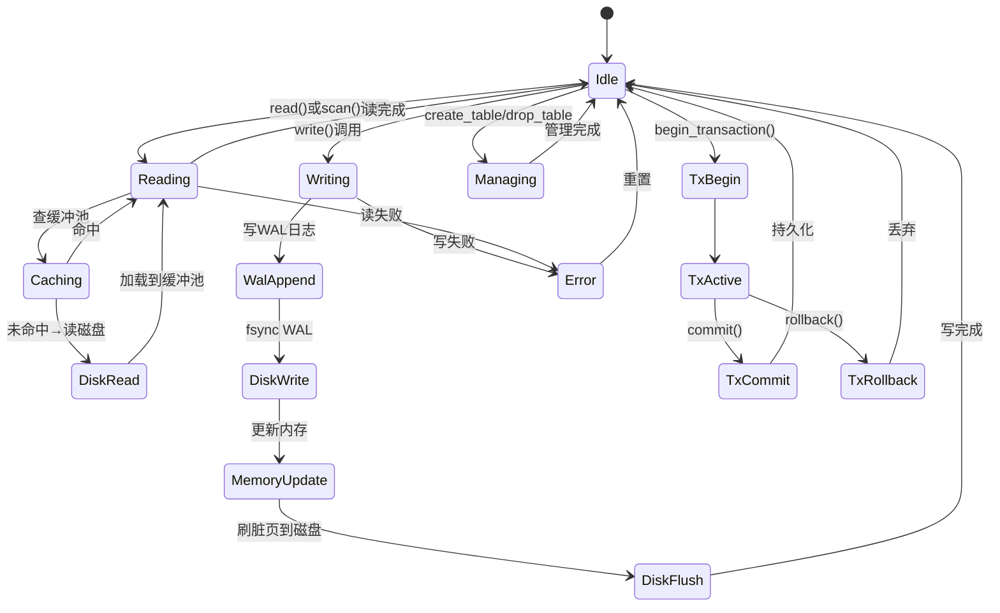
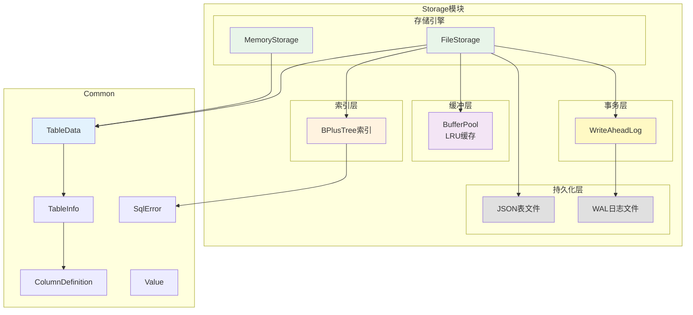
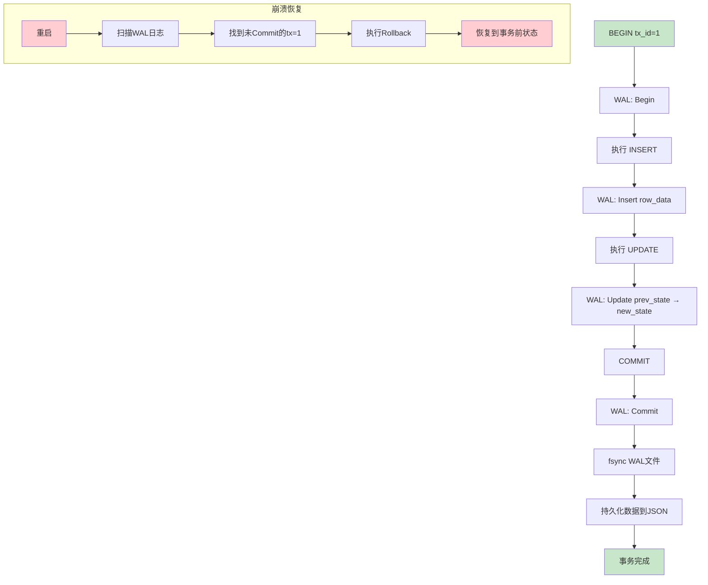
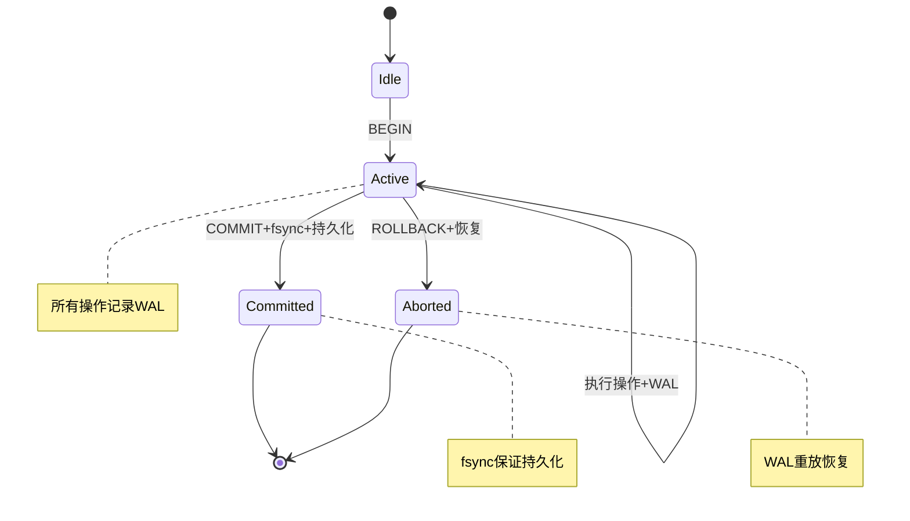

# SQLRustGo 1.0 Storage 模块设计

## 一、OOA 分析

### 1. 用例图



### 2. 概念类图



### 3. 活动图



---

## 二、OOD 设计

### 1. 设计类图



### 2. 顺序图



### 3. 状态图



### 4. 组件图



---

## 三、详细设计文档

### 1. 模块概述

Storage 模块是 SQLRustGo 的数据持久化核心，负责表数据的存储、读取、扫描和索引管理。1.0版本采用 **JSON文件存储** 格式，结合 **B+Tree索引** 加速查询，通过 **WAL预写日志** 保障事务一致性。

**设计目标：**
- 1.0版本：JSON文件存储 + B+Tree索引 + WAL事务
- 1.1版本：二进制页存储 + BufferPool缓存
- 1.2版本：MVCC + 分布式存储

### 2. 核心功能

| 功能 | 描述 | 1.0状态 |
|------|------|---------|
| 表存储 | JSON文件格式持久化表数据 | ✅ 实现 |
| 表加载 | 启动时自动加载所有表 | ✅ 实现 |
| 行读取 | 按索引或位置读取单行 | ✅ 实现 |
| 行写入 | 插入/更新/删除行 | ✅ 实现 |
| 全表扫描 | 迭代所有行数据 | ✅ 实现 |
| B+Tree索引 | INTEGER类型索引 | ✅ 实现 |
| WAL事务 | 预写日志崩溃恢复 | ✅ 实现 |
| 缓冲池 | LRU页面缓存 | ❌ 标记未来功能 |
| 页面管理 | 4KB固定页 | ❌ 标记未来功能 |
| 表创建 | CREATE TABLE持久化 | ✅ 实现 |
| 表删除 | DROP TABLE持久化 | ✅ 实现 |

### 3. 类与接口设计

#### 3.1 核心接口

```rust
pub trait StorageEngine {
    fn read(&self, table: &str, key: &Value) -> SqlResult<Option<Vec<Value>>>;
    fn write(&mut self, table: &str, row: Vec<Value>) -> SqlResult<()>;
    fn scan(&self, table: &str, filter: Option<&Predicate>) -> SqlResult<Vec<Vec<Value>>>;
    fn update(&mut self, table: &str, key: &Value, new_row: Vec<Value>) -> SqlResult<()>;
    fn delete(&mut self, table: &str, key: &Value) -> SqlResult<()>;
    fn create_table(&mut self, name: &str, schema: TableInfo) -> SqlResult<()>;
    fn drop_table(&mut self, name: &str) -> SqlResult<()>;
    fn get_table(&self, name: &str) -> Option<&TableData>;
    fn get_table_mut(&mut self, name: &str) -> Option<&mut TableData>;
    fn persist_table(&self, name: &str) -> SqlResult<()>;
}
```

#### 3.2 FileStorage 实现

```rust
pub struct FileStorage {
    pub data_dir: PathBuf,
    tables: HashMap<String, TableData>,
    indexes: HashMap<String, HashMap<String, BPlusTree<i64, usize>>>,
    wal: Option<Arc<Mutex<WriteAheadLog>>>,
}

impl FileStorage {
    pub fn new() -> Self {
        Self {
            data_dir: PathBuf::from("data"),
            tables: HashMap::new(),
            indexes: HashMap::new(),
            wal: None,
        }
    }
    
    pub fn with_data_dir(data_dir: PathBuf) -> Self {
        Self { data_dir, tables: HashMap::new(), indexes: HashMap::new(), wal: None }
    }
    
    pub fn load_all(&mut self) -> SqlResult<()> {
        if !self.data_dir.exists() {
            std::fs::create_dir_all(&self.data_dir)?;
            return Ok(());
        }
        for entry in std::fs::read_dir(&self.data_dir)? {
            let path = entry?.path();
            if path.extension().and_then(|e| e.to_str()) == Some("json") {
                let content = std::fs::read_to_string(&path)?;
                let table: TableData = serde_json::from_str(&content)?;
                let name = table.info.name.clone();
                self.tables.insert(name, table);
            }
        }
        Ok(())
    }
    
    pub fn save_all(&self) -> SqlResult<()> {
        std::fs::create_dir_all(&self.data_dir)?;
        for (name, table) in &self.tables {
            let json = table.to_json();
            let path = self.data_dir.join(format!("{}.json", name));
            std::fs::write(path, json)?;
        }
        Ok(())
    }
    
    pub fn create_index(&mut self, table: &str, column: &str) -> SqlResult<()> {
        let table_data = self.tables.get(table)
            .ok_or_else(|| SqlError::TableNotFound(table.to_string()))?;
        let col_idx = table_data.info.columns.iter()
            .position(|c| c.name == column)
            .ok_or_else(|| SqlError::ColumnNotFound(column.to_string()))?;
        
        let mut tree: BPlusTree<i64, usize> = BPlusTree::new();
        for (row_idx, row) in table_data.rows.iter().enumerate() {
            if let Some(Value::Integer(key)) = row.get(col_idx) {
                tree.insert(*key, row_idx);
            }
        }
        
        self.indexes
            .entry(table.to_string())
            .or_default()
            .insert(column.to_string(), tree);
        Ok(())
    }
}
```

#### 3.3 TableData 结构

```rust
#[derive(Debug, Clone, Serialize, Deserialize)]
pub struct TableData {
    pub info: TableInfo,
    pub rows: Vec<Vec<Value>>,
}

#[derive(Debug, Clone, Serialize, Deserialize)]
pub struct TableInfo {
    pub name: String,
    pub columns: Vec<ColumnDefinition>,
}

#[derive(Debug, Clone, Serialize, Deserialize)]
pub struct ColumnDefinition {
    pub name: String,
    pub data_type: String,
    pub nullable: bool,
    #[serde(default)]
    pub default_value: Option<Value>,
    #[serde(default)]
    pub is_primary_key: bool,
}

impl TableData {
    pub fn new(name: String, columns: Vec<ColumnDefinition>) -> Self {
        Self {
            info: TableInfo { name, columns },
            rows: Vec::new(),
        }
    }
    
    pub fn to_json(&self) -> String {
        serde_json::to_string_pretty(self).unwrap_or_default()
    }
    
    pub fn from_json(json: &str) -> Result<Self, serde_json::Error> {
        serde_json::from_str(json)
    }
}
```

#### 3.4 B+Tree 实现（简化版）

```rust
pub struct BPlusTree<K: Ord + Clone, V: Clone> {
    root: Option<Box<Node<K, V>>>,
    order: usize,
    size: usize,
}

enum Node<K, V> {
    Internal { keys: Vec<K>, children: Vec<Box<Node<K, V>>> },
    Leaf { entries: Vec<(K, V)>, next: Option<Box<Node<K, V>>> },
}

impl<K: Ord + Clone, V: Clone> BPlusTree<K, V> {
    pub fn new() -> Self {
        Self { root: None, order: 4, size: 0 }
    }
    
    pub fn insert(&mut self, key: K, value: V) {
        match &mut self.root {
            None => {
                let mut leaf = Node::Leaf { entries: vec![(key, value)], next: None };
                self.root = Some(Box::new(leaf));
                self.size = 1;
            }
            Some(root) => {
                self.insert_recursive(root, key, value);
                self.size += 1;
            }
        }
    }
    
    pub fn search(&self, key: &K) -> Option<&V> {
        let mut current = self.root.as_ref();
        while let Some(node) = current {
            match node.as_ref() {
                Node::Leaf { entries, .. } => {
                    return entries.iter().find(|(k, _)| k == key).map(|(_, v)| v);
                }
                Node::Internal { keys, children } => {
                    let mut idx = 0;
                    while idx < keys.len() && key > &keys[idx] { idx += 1; }
                    current = children[idx].as_ref();
                }
            }
        }
        None
    }
    
    pub fn delete(&mut self, key: &K) -> bool {
        if let Some(root) = &mut self.root {
            if self.delete_recursive(root, key) {
                self.size -= 1;
                return true;
            }
        }
        false
    }
    
    pub fn range_query(&self, start: &K, end: &K) -> Vec<V> {
        let mut result = Vec::new();
        let mut current = self.root.as_ref();
        while let Some(node) = current {
            match node.as_ref() {
                Node::Leaf { entries, .. } => {
                    for (k, v) in entries {
                        if k >= start && k <= end { result.push(v.clone()); }
                    }
                    break;
                }
                Node::Internal { keys, children } => {
                    let mut idx = 0;
                    while idx < keys.len() && start > &keys[idx] { idx += 1; }
                    current = children[idx].as_ref();
                }
            }
        }
        result
    }
    
    pub fn len(&self) -> usize { self.size }
    pub fn is_empty(&self) -> bool { self.size == 0 }
}
```

#### 3.5 WAL 实现

```rust
pub struct WriteAheadLog {
    file: Mutex<File>,
    dir: PathBuf,
    current_segment: Option<PathBuf>,
}

#[derive(Debug, Clone, Serialize, Deserialize)]
pub struct WalRecord {
    pub tx_id: u64,
    pub timestamp: i64,
    pub op_type: WalOpType,
    pub table_name: String,
    pub row_data: Option<String>,
    pub prev_state: Option<String>,
}

#[derive(Debug, Clone, Serialize, Deserialize)]
pub enum WalOpType {
    Begin,
    Insert,
    Update,
    Delete,
    Commit,
    Rollback,
    Checkpoint,
}

impl WriteAheadLog {
    pub fn new(dir: &str) -> SqlResult<Self> {
        let wal_dir = PathBuf::from(dir);
        std::fs::create_dir_all(&wal_dir)?;
        let segment_path = wal_dir.join("wal-000001.log");
        let file = OpenOptions::new().create(true).append(true).open(&segment_path)?;
        Ok(Self {
            file: Mutex::new(file),
            dir: wal_dir,
            current_segment: Some(segment_path),
        })
    }
    
    pub fn append(&self, record: WalRecord) -> SqlResult<()> {
        let mut file = self.file.lock().unwrap();
        let json = serde_json::to_string(&record)?;
        writeln!(file, "{}", json)?;
        Ok(())
    }
    
    pub fn flush(&self) -> SqlResult<()> {
        let file = self.file.lock().unwrap();
        file.sync_all()?;
        Ok(())
    }
    
    pub fn recover(&self) -> SqlResult<Vec<WalRecord>> {
        let mut records = Vec::new();
        if let Some(segment) = &self.current_segment {
            if segment.exists() {
                let content = std::fs::read_to_string(segment)?;
                for line in content.lines() {
                    if let Ok(record) = serde_json::from_str::<WalRecord>(line) {
                        records.push(record);
                    }
                }
            }
        }
        Ok(records)
    }
}
```

### 4. 执行流程

```mermaid
flowchart TD
    subgraph 写入流程
        A[Executor.write] --> B{开启事务?}
        B -->|是| C[WAL.append Begin]
        B -->|否| D[直接写]
        C --> D
        D --> E{有索引?}
        E -->|是| F[更新B+Tree索引]
        E -->|否| G[直接更新rows]
        F --> G
        G --> H[WAL.append 操作日志]
        H --> I[内存修改]
        I --> J{事务?}
        J -->|是| K[WAL.append Commit + fsync]
        J -->|否| L[persist 写JSON文件]
        K --> L
        L --> M[返回Ok]
    end
    
    subgraph 读取流程
        N[Executor.scan] --> O{有匹配索引?}
        O -->|是| P[B+Tree.search/range]
        P --> Q[按row_idx定位行]
        O -->|否| R[全表迭代rows]
        Q --> S[Predicate过滤]
        R --> S
        S --> T[返回匹配行]
    end
    
    style A fill:#e8f5e9
    style N fill:#e3f2fd
    style M fill:#c8e6c9
    style T fill:#bbdefb
```



### 5. 事务处理

#### 5.1 WAL 事务流程



#### 5.2 事务状态机



#### 5.3 TransactionManager 集成

```rust
pub struct TransactionManager {
    wal: Arc<WriteAheadLog>,
    active_txs: HashMap<u64, TransactionState>,
    next_tx_id: AtomicU64,
}

#[derive(Debug, Clone)]
pub struct TransactionState {
    pub tx_id: u64,
    pub status: TxStatus,
    pub operations: Vec<WalOpType>,
    pub created_at: i64,
}

#[derive(Debug, Clone)]
pub enum TxStatus {
    Active,
    Committed,
    RolledBack,
}

impl TransactionManager {
    pub fn new(wal: Arc<WriteAheadLog>) -> Self {
        Self { wal, active_txs: HashMap::new(), next_tx_id: AtomicU64::new(0) }
    }
    
    pub fn begin(&mut self) -> SqlResult<u64> {
        let tx_id = self.next_tx_id.fetch_add(1, Ordering::SeqCst) + 1;
        self.wal.append(WalRecord {
            tx_id, timestamp: now(), op_type: WalOpType::Begin,
            table_name: String::new(), row_data: None, prev_state: None,
        })?;
        self.active_txs.insert(tx_id, TransactionState {
            tx_id, status: TxStatus::Active, operations: vec![WalOpType::Begin], created_at: now(),
        });
        Ok(tx_id)
    }
    
    pub fn commit(&mut self, tx_id: u64) -> SqlResult<()> {
        let record = WalRecord {
            tx_id, timestamp: now(), op_type: WalOpType::Commit,
            table_name: String::new(), row_data: None, prev_state: None,
        };
        self.wal.append(record)?;
        self.wal.flush()?;
        if let Some(state) = self.active_txs.get_mut(&tx_id) {
            state.status = TxStatus::Committed;
        }
        Ok(())
    }
    
    pub fn rollback(&mut self, tx_id: u64) -> SqlResult<()> {
        let record = WalRecord {
            tx_id, timestamp: now(), op_type: WalOpType::Rollback,
            table_name: String::new(), row_data: None, prev_state: None,
        };
        self.wal.append(record)?;
        if let Some(state) = self.active_txs.get_mut(&tx_id) {
            state.status = TxStatus::RolledBack;
        }
        Ok(())
    }
    
    pub fn recover(&mut self) -> SqlResult<()> {
        let records = self.wal.recover()?;
        let mut tx_ops: HashMap<u64, Vec<WalRecord>> = HashMap::new();
        for record in records {
            tx_ops.entry(record.tx_id).or_default().push(record);
        }
        for (tx_id, ops) in tx_ops {
            let last_op = ops.last();
            if let Some(record) = last_op {
                match record.op_type {
                    WalOpType::Commit => { /* 已提交，数据已持久化 */ }
                    WalOpType::Rollback => { /* 已回滚，无需操作 */ }
                    _ => { /* 未完成事务，需回滚 */
                        self.rollback(tx_id)?;
                    }
                }
            }
        }
        Ok(())
    }
}
```

### 6. 性能考虑

| 方面 | 考虑 | 1.0实现 |
|------|------|---------|
| **存储格式** | JSON格式，人类可读，便于调试 | ✅ 实现 |
| **持久化时机** | 每次写操作后立即fsync | ✅ 实现 |
| **索引类型** | B+Tree，支持范围查询 | ✅ 实现 |
| **索引类型限制** | 仅支持INTEGER键 | ⚠️ 1.0限制 |
| **缓冲池** | LRU缓存，减少磁盘I/O | ❌ 标记未来功能 |
| **页面管理** | 4KB固定页，更高效的持久化 | ❌ 标记未来功能 |
| **批量操作** | 批量INSERT/UPDATE减少fsync次数 | ⚠️ 1.0支持单次 |
| **WAL分段** | 日志分段，限制单个文件大小 | ⚠️ 1.0单文件 |
| **并发安全** | Mutex保护共享状态 | ✅ 使用Mutex |
| **崩溃恢复** | WAL重放未完成事务 | ✅ 实现 |

### 7. 1.0版本实现清单

| 序号 | 组件 | 实现内容 | 优先级 |
|------|------|----------|--------|
| 1 | FileStorage | JSON文件存储引擎 | P0 |
| 2 | TableData / TableInfo | 表结构+数据行 | P0 |
| 3 | ColumnDefinition | 列定义结构 | P0 |
| 4 | BPlusTree | B+Tree索引 | P0 |
| 5 | 索引创建/查询 | create_index + search/range | P1 |
| 6 | WriteAheadLog | WAL预写日志 | P1 |
| 7 | TransactionManager | 事务管理器 | P1 |
| 8 | WAL崩溃恢复 | recover() + 事务重放 | P1 |
| 9 | MemoryStorage | 纯内存存储 | P2 |
| 10 | BufferPool | LRU缓冲池 | P2（标记未来） |
| 11 | Page/PageFrame | 页面管理 | P2（标记未来） |
