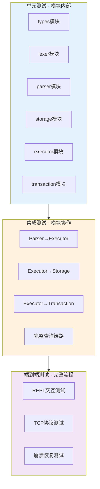
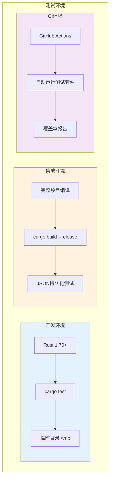
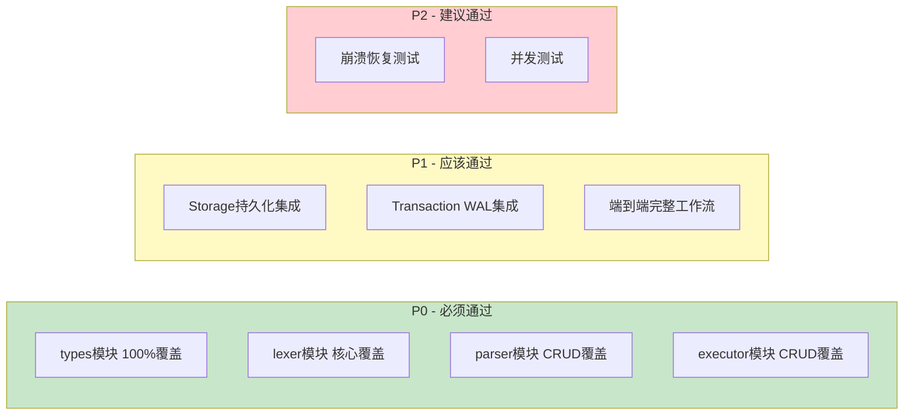

# SQLRustGo 1.0 测试计划

## 1. 测试目标

| 目标 | 描述 | 验收标准 |
|------|------|----------|
| 功能正确性 | 验证所有SQL语句正确执行 | 所有核心用例通过 |
| 数据持久化 | 验证重启后数据不丢失 | WAL恢复 + JSON加载通过 |
| 事务一致性 | 验证事务ACID特性 | COMMIT/ROLLBACK正确 |
| 并发安全 | 验证多线程访问安全 | Mutex保护 + 无数据竞争 |
| 错误恢复 | 验证异常后系统可恢复 | WAL崩溃恢复通过 |

## 2. 测试策略



## 3. 测试用例

### 3.1 单元测试

#### 3.1.1 types 模块

| 编号 | 测试用例 | 输入 | 预期 |
|------|----------|------|------|
| T-TP-001 | Value::Null创建 | Value::Null | 不panic |
| T-TP-002 | Value::Integer创建 | Value::Integer(42) | 存储值42 |
| T-TP-003 | Value::Text创建 | Value::Text("hello") | 存储"hello" |
| T-TP-004 | Value相等比较 | Value::Integer(1) == Value::Integer(1) | true |
| T-TP-005 | Value不等比较 | Value::Integer(1) == Value::Integer(2) | false |
| T-TP-006 | Value不同类型比较 | Value::Integer(1) == Value::Text("1") | false |
| T-TP-007 | SqlError::ParseError创建 | SqlError::ParseError("test") | 错误消息正确 |
| T-TP-008 | SqlResult Ok分支 | SqlResult::Ok(42) | unwrap为42 |
| T-TP-009 | SqlResult Err分支 | SqlResult::Err(error) | unwrap_err为error |

```rust
#[cfg(test)]
mod tests {
    use sqlrustgo::types::{Value, SqlError, SqlResult};

    #[test]
    fn test_value_null() {
        let v = Value::Null;
        assert_eq!(v, Value::Null);
    }

    #[test]
    fn test_value_integer() {
        let v = Value::Integer(42);
        assert_eq!(v, Value::Integer(42));
    }

    #[test]
    fn test_value_text() {
        let v = Value::Text("hello".to_string());
        assert_eq!(v, Value::Text("hello".to_string()));
    }

    #[test]
    fn test_value_equality() {
        assert_eq!(Value::Integer(1), Value::Integer(1));
        assert_ne!(Value::Integer(1), Value::Integer(2));
        assert_ne!(Value::Integer(1), Value::Text("1".to_string()));
    }

    #[test]
    fn test_sql_error_parse() {
        let err = SqlError::ParseError("syntax error".to_string());
        assert!(matches!(err, SqlError::ParseError(_)));
    }

    #[test]
    fn test_sql_result_ok() {
        let result: SqlResult<i32> = Ok(42);
        assert_eq!(result.unwrap(), 42);
    }

    #[test]
    fn test_sql_result_err() {
        let error = SqlError::ExecutionError("test".to_string());
        let result: SqlResult<i32> = Err(error.clone());
        assert!(result.is_err());
    }
}
```

#### 3.1.2 lexer 模块

| 编号 | 测试用例 | 输入 | 预期Token序列 |
|------|----------|------|---------------|
| T-LX-001 | 空字符串 | "" | [EOF] |
| T-LX-002 | 纯SELECT | "SELECT" | [SELECT, EOF] |
| T-LX-003 | SELECT * FROM | "SELECT * FROM users" | [SELECT, *, FROM, IDENT("users"), EOF] |
| T-LX-004 | WHERE条件 | "WHERE id = 1" | [WHERE, IDENT("id"), =, INT(1), EOF] |
| T-LX-005 | 字符串字面量 | "INSERT INTO t VALUES ('hello')" | [INSERT, INTO, IDENT("t"), VALUES, (, STR("hello"), ), EOF] |
| T-LX-006 | 数字字面量 | "UPDATE t SET n = 3.14" | [UPDATE, IDENT("t"), SET, IDENT("n"), =, FLOAT(3.14), EOF] |
| T-LX-007 | 注释忽略 | "SELECT /* comment */ 1" | [SELECT, INT(1), EOF] |
| T-LX-008 | 空白处理 | "  SELECT   *  \n  FROM  t  " | [SELECT, *, FROM, IDENT("t"), EOF] |
| T-LX-009 | 非法字符 | "SELECT @@@" | 返回词法错误 |
| T-LX-010 | 关键字大小写 | "select FROM Users" | [SELECT, FROM, IDENT("Users"), EOF] |

```rust
#[cfg(test)]
mod tests {
    use sqlrustgo::lexer::{Lexer, TokenType};

    fn token_types(tokens: &[sqlrustgo::lexer::Token]) -> Vec<TokenType> {
        tokens.iter().map(|t| t.token_type.clone()).collect()
    }

    #[test]
    fn test_empty_input() {
        let lexer = Lexer::new("");
        let tokens = lexer.tokenize().unwrap();
        assert_eq!(tokens.len(), 1);
        assert!(matches!(tokens[0].token_type, TokenType::EOF));
    }

    #[test]
    fn test_simple_select() {
        let lexer = Lexer::new("SELECT * FROM users");
        let tokens = lexer.tokenize().unwrap();
        let types = token_types(&tokens);
        assert_eq!(types[0], TokenType::Keyword("SELECT".to_string()));
        assert_eq!(types[1], TokenType::Operator("*".to_string()));
        assert_eq!(types[2], TokenType::Keyword("FROM".to_string()));
        assert!(matches!(types[3], TokenType::Identifier(_)));
        assert!(matches!(types[4], TokenType::EOF));
    }

    #[test]
    fn test_where_condition() {
        let lexer = Lexer::new("WHERE id = 1");
        let tokens = lexer.tokenize().unwrap();
        assert!(matches!(tokens[0].token_type, TokenType::Keyword(ref k) if k == "WHERE"));
        assert!(matches!(tokens[1].token_type, TokenType::Identifier(ref v) if v == "id"));
        assert!(matches!(tokens[2].token_type, TokenType::Operator(ref v) if v == "="));
        assert!(matches!(tokens[3].token_type, TokenType::Number(_)));
    }

    #[test]
    fn test_string_literal() {
        let lexer = Lexer::new("INSERT INTO t VALUES ('hello')");
        let tokens = lexer.tokenize().unwrap();
        let str_token = tokens.iter().find(|t| matches!(t.token_type, TokenType::String(_)));
        assert!(str_token.is_some());
        assert!(matches!(str_token.unwrap().token_type, TokenType::String(ref s) if s == "hello"));
    }

    #[test]
    fn test_lex_error() {
        let lexer = Lexer::new("SELECT @@@");
        let result = lexer.tokenize();
        assert!(result.is_err() || result.unwrap().iter().any(|t| matches!(t.token_type, TokenType::Error(_))));
    }

    #[test]
    fn test_whitespace_handling() {
        let lexer = Lexer::new("  SELECT   *  \n  FROM  t  ");
        let tokens = lexer.tokenize().unwrap();
        assert_eq!(tokens.iter().filter(|t| !matches!(t.token_type, TokenType::EOF)).count(), 3);
    }
}
```

#### 3.1.3 parser 模块

| 编号 | 测试用例 | 输入 | 预期AST类型 |
|------|----------|------|-------------|
| T-PA-001 | 简单SELECT | "SELECT * FROM users" | SelectStatement |
| T-PA-002 | SELECT带WHERE | "SELECT * FROM users WHERE id = 1" | SelectStatement(带Filter) |
| T-PA-003 | SELECT带ORDER BY | "SELECT * FROM users ORDER BY id" | SelectStatement(带OrderBy) |
| T-PA-004 | INSERT基本 | "INSERT INTO users VALUES (1, 'Alice')" | InsertStatement |
| T-PA-005 | INSERT指定列 | "INSERT INTO users (id, name) VALUES (1, 'Alice')" | InsertStatement |
| T-PA-006 | UPDATE基本 | "UPDATE users SET name = 'Bob' WHERE id = 1" | UpdateStatement |
| T-PA-007 | DELETE基本 | "DELETE FROM users WHERE id = 1" | DeleteStatement |
| T-PA-008 | CREATE TABLE | "CREATE TABLE users (id INT, name TEXT)" | CreateTableStatement |
| T-PA-009 | DROP TABLE | "DROP TABLE users" | DropTableStatement |
| T-PA-010 | 语法错误 | "SELECT * FROM" | ParseError |
| T-PA-011 | 空输入 | "" | ParseError |
| T-PA-012 | 复杂WHERE | "SELECT * FROM users WHERE id = 1 AND name = 'Alice'" | SelectStatement(AND条件) |

```rust
#[cfg(test)]
mod tests {
    use sqlrustgo::parser::{Parser, Statement};

    #[test]
    fn test_parse_simple_select() {
        let parser = Parser::new("SELECT * FROM users");
        let stmt = parser.parse().unwrap();
        assert!(matches!(stmt, Statement::Select(_)));
    }

    #[test]
    fn test_parse_select_where() {
        let parser = Parser::new("SELECT * FROM users WHERE id = 1");
        let stmt = parser.parse().unwrap();
        assert!(matches!(stmt, Statement::Select(_)));
    }

    #[test]
    fn test_parse_insert() {
        let parser = Parser::new("INSERT INTO users VALUES (1, 'Alice')");
        let stmt = parser.parse().unwrap();
        assert!(matches!(stmt, Statement::Insert(_)));
    }

    #[test]
    fn test_parse_update() {
        let parser = Parser::new("UPDATE users SET name = 'Bob' WHERE id = 1");
        let stmt = parser.parse().unwrap();
        assert!(matches!(stmt, Statement::Update(_)));
    }

    #[test]
    fn test_parse_delete() {
        let parser = Parser::new("DELETE FROM users WHERE id = 1");
        let stmt = parser.parse().unwrap();
        assert!(matches!(stmt, Statement::Delete(_)));
    }

    #[test]
    fn test_parse_create_table() {
        let parser = Parser::new("CREATE TABLE users (id INT, name TEXT)");
        let stmt = parser.parse().unwrap();
        assert!(matches!(stmt, Statement::CreateTable(_)));
    }

    #[test]
    fn test_parse_drop_table() {
        let parser = Parser::new("DROP TABLE users");
        let stmt = parser.parse().unwrap();
        assert!(matches!(stmt, Statement::DropTable(_)));
    }

    #[test]
    fn test_parse_syntax_error() {
        let parser = Parser::new("SELECT * FROM");
        let result = parser.parse();
        assert!(result.is_err());
    }

    #[test]
    fn test_parse_empty() {
        let parser = Parser::new("");
        let result = parser.parse();
        assert!(result.is_err());
    }
}
```

#### 3.1.4 storage 模块

| 编号 | 测试用例 | 输入 | 预期 |
|------|----------|------|------|
| T-ST-001 | 创建表 | CREATE TABLE t | tables["t"]存在 |
| T-ST-002 | 插入行 | INSERT INTO t VALUES(1) | rows.len() == 1 |
| T-ST-003 | 读取行 | get_table("t") | 表数据正确 |
| T-ST-004 | 更新行 | UPDATE t SET v=2 WHERE id=1 | rows[0] = [2] |
| T-ST-005 | 删除行 | DELETE FROM t WHERE id=1 | rows.len() == 0 |
| T-ST-006 | 删除表 | DROP TABLE t | tables.remove("t") |
| T-ST-007 | 持久化 | save_all() | JSON文件存在 |
| T-ST-008 | 加载 | load_all() | 表数据恢复 |
| T-ST-009 | B+Tree插入 | tree.insert(1, 0) | tree.search(1) == Some(0) |
| T-ST-010 | B+Tree范围 | tree.range(1, 5) | 返回匹配行索引 |
| T-ST-011 | 表不存在 | get_table("nonexistent") | None |
| T-ST-012 | 列不存在 | CREATE TABLE t(x INT) → SELECT y FROM t | ColumnNotFound |

```rust
#[cfg(test)]
mod tests {
    use sqlrustgo::storage::{FileStorage, BPlusTree};
    use sqlrustgo::types::{Value, TableInfo, ColumnDefinition};

    fn make_temp_dir() -> std::path::PathBuf {
        let mut dir = std::env::temp_dir();
        dir.push(format!("sqlrustgo_test_{}", rand::random::<u64>()));
        std::fs::create_dir_all(&dir).unwrap();
        dir
    }

    #[test]
    fn test_create_and_get_table() {
        let dir = make_temp_dir();
        let mut storage = FileStorage::with_data_dir(dir.clone());
        let schema = TableInfo {
            name: "users".to_string(),
            columns: vec![
                ColumnDefinition { name: "id".to_string(), data_type: "INT".to_string(), nullable: false, default_value: None, is_primary_key: true },
                ColumnDefinition { name: "name".to_string(), data_type: "TEXT".to_string(), nullable: false, default_value: None, is_primary_key: false },
            ],
        };
        storage.create_table("users", schema).unwrap();
        assert!(storage.get_table("users").is_some());
    }

    #[test]
    fn test_insert_and_read_row() {
        let dir = make_temp_dir();
        let mut storage = FileStorage::with_data_dir(dir.clone());
        let schema = TableInfo {
            name: "t".to_string(),
            columns: vec![
                ColumnDefinition { name: "id".to_string(), data_type: "INT".to_string(), nullable: false, default_value: None, is_primary_key: true },
            ],
        };
        storage.create_table("t", schema).unwrap();
        storage.write("t", vec![Value::Integer(1)]).unwrap();
        let table = storage.get_table("t").unwrap();
        assert_eq!(table.rows.len(), 1);
    }

    #[test]
    fn test_bplus_tree_insert_search() {
        let mut tree: BPlusTree<i64, usize> = BPlusTree::new();
        tree.insert(1, 0);
        tree.insert(3, 1);
        tree.insert(5, 2);
        assert_eq!(tree.search(&1), Some(&0));
        assert_eq!(tree.search(&3), Some(&1));
        assert_eq!(tree.search(&5), Some(&2));
        assert_eq!(tree.search(&99), None);
    }

    #[test]
    fn test_bplus_tree_range() {
        let mut tree: BPlusTree<i64, usize> = BPlusTree::new();
        for i in 1..=10 { tree.insert(i, (i - 1) as usize); }
        let results = tree.range_query(&3, &7);
        assert_eq!(results.len(), 5);
    }

    #[test]
    fn test_persist_and_load() {
        let dir = make_temp_dir();
        let { save_dir, load_dir } = (dir.clone(), dir.clone());
        
        let mut storage = FileStorage::with_data_dir(save_dir.clone());
        let schema = TableInfo {
            name: "data".to_string(),
            columns: vec![
                ColumnDefinition { name: "id".to_string(), data_type: "INT".to_string(), nullable: false, default_value: None, is_primary_key: true },
                ColumnDefinition { name: "v".to_string(), data_type: "INT".to_string(), nullable: false, default_value: None, is_primary_key: false },
            ],
        };
        storage.create_table("data", schema).unwrap();
        storage.write("data", vec![Value::Integer(1), Value::Integer(100)]).unwrap();
        storage.persist_table("data").unwrap();
        
        let mut storage2 = FileStorage::with_data_dir(load_dir);
        storage2.load_all().unwrap();
        let table = storage2.get_table("data").unwrap();
        assert_eq!(table.rows.len(), 1);
        assert_eq!(table.rows[0], vec![Value::Integer(1), Value::Integer(100)]);
        
        std::fs::remove_dir_all(&save_dir).ok();
    }

    #[test]
    fn test_get_nonexistent_table() {
        let dir = make_temp_dir();
        let storage = FileStorage::with_data_dir(dir);
        assert!(storage.get_table("nonexistent").is_none());
    }
}
```

#### 3.1.5 executor 模块

| 编号 | 测试用例 | 输入SQL | 预期结果 |
|------|----------|---------|----------|
| T-EX-001 | 空表SELECT | CREATE TABLE t(id INT); SELECT * FROM t | rows=[] |
| T-EX-002 | INSERT+SELECT | INSERT INTO t VALUES(1); SELECT * FROM t | rows=[[1]] |
| T-EX-003 | 多行INSERT | INSERT INTO t VALUES(1),(2),(3) | rows.len()==3 |
| T-EX-004 | UPDATE | UPDATE t SET id=5 WHERE id=1 | rows=[[5]] |
| T-EX-005 | DELETE | DELETE FROM t WHERE id=1 | rows=[] |
| T-EX-006 | WHERE过滤 | SELECT * FROM t WHERE id>2 | 只返回匹配行 |
| T-EX-007 | 不存在的表 | SELECT * FROM nonexistent | TableNotFound错误 |
| T-EX-008 | 类型不匹配 | INSERT INTO t VALUES('abc') | TypeMismatch错误 |

```rust
#[cfg(test)]
mod tests {
    use sqlrustgo::ExecutionEngine;
    use sqlrustgo::parser::Parser;
    use sqlrustgo::types::SqlResult;

    fn exec_sql(engine: &mut ExecutionEngine, sql: &str) -> SqlResult<sqlrustgo::types::ExecutionResult> {
        let parser = Parser::new(sql);
        let stmt = parser.parse()?;
        engine.execute(stmt)
    }

    fn make_engine() -> ExecutionEngine {
        let mut engine = ExecutionEngine::new();
        let _ = exec_sql(&mut engine, "CREATE TABLE test (id INT)");
        engine
    }

    #[test]
    fn test_empty_table_select() {
        let mut engine = make_engine();
        let result = exec_sql(&mut engine, "SELECT * FROM test").unwrap();
        assert_eq!(result.rows.len(), 0);
    }

    #[test]
    fn test_insert_and_select() {
        let mut engine = make_engine();
        exec_sql(&mut engine, "INSERT INTO test VALUES (1)").unwrap();
        let result = exec_sql(&mut engine, "SELECT * FROM test").unwrap();
        assert_eq!(result.rows.len(), 1);
        assert_eq!(result.rows[0][0], sqlrustgo::types::Value::Integer(1));
    }

    #[test]
    fn test_multi_insert() {
        let mut engine = make_engine();
        exec_sql(&mut engine, "INSERT INTO test VALUES (1)").unwrap();
        exec_sql(&mut engine, "INSERT INTO test VALUES (2)").unwrap();
        exec_sql(&mut engine, "INSERT INTO test VALUES (3)").unwrap();
        let result = exec_sql(&mut engine, "SELECT * FROM test").unwrap();
        assert_eq!(result.rows.len(), 3);
    }

    #[test]
    fn test_update() {
        let mut engine = make_engine();
        exec_sql(&mut engine, "INSERT INTO test VALUES (1)").unwrap();
        exec_sql(&mut engine, "UPDATE test SET id = 5 WHERE id = 1").unwrap();
        let result = exec_sql(&mut engine, "SELECT * FROM test").unwrap();
        assert_eq!(result.rows[0][0], sqlrustgo::types::Value::Integer(5));
    }

    #[test]
    fn test_delete() {
        let mut engine = make_engine();
        exec_sql(&mut engine, "INSERT INTO test VALUES (1)").unwrap();
        exec_sql(&mut engine, "DELETE FROM test WHERE id = 1").unwrap();
        let result = exec_sql(&mut engine, "SELECT * FROM test").unwrap();
        assert_eq!(result.rows.len(), 0);
    }

    #[test]
    fn test_where_filter() {
        let mut engine = make_engine();
        for i in 1..=10 {
            let _ = exec_sql(&mut engine, &format!("INSERT INTO test VALUES ({})", i));
        }
        let result = exec_sql(&mut engine, "SELECT * FROM test WHERE id > 7").unwrap();
        assert_eq!(result.rows.len(), 3);
    }

    #[test]
    fn test_table_not_found() {
        let mut engine = make_engine();
        let result = exec_sql(&mut engine, "SELECT * FROM nonexistent");
        assert!(result.is_err());
    }
}
```

#### 3.1.6 transaction 模块

| 编号 | 测试用例 | 输入 | 预期 |
|------|----------|------|------|
| T-TX-001 | BEGIN | tx.begin() | tx_id = 1 |
| T-TX-002 | COMMIT | tx.commit(1) | WAL写入Commit |
| T-TX-003 | ROLLBACK | tx.rollback(1) | WAL写入Rollback |
| T-TX-004 | 事务状态 | tx.get_state(1) | Active/Committed/RolledBack |
| T-TX-005 | WAL追加 | wal.append(record) | 文件写入 |
| T-TX-006 | WAL恢复 | wal.recover() | 返回所有记录 |

```rust
#[cfg(test)]
mod tests {
    use sqlrustgo::transaction::{TransactionManager, WriteAheadLog, WalRecord, WalOpType};
    use std::sync::Arc;

    fn make_temp_wal_dir() -> std::path::PathBuf {
        let mut dir = std::env::temp_dir();
        dir.push(format!("sqlrustgo_wal_{}", rand::random::<u64>()));
        std::fs::create_dir_all(&dir).unwrap();
        dir
    }

    #[test]
    fn test_wal_append_and_recover() {
        let dir = make_temp_wal_dir();
        let wal = WriteAheadLog::new(dir.to_str().unwrap()).unwrap();
        let wal_arc = Arc::new(wal);
        let mut tx_manager = TransactionManager::new(wal_arc.clone());
        
        let tx_id = tx_manager.begin().unwrap();
        assert_eq!(tx_manager.is_active(tx_id), true);
        
        tx_manager.commit(tx_id).unwrap();
        assert_eq!(tx_manager.get_state(tx_id).unwrap().status, sqlrustgo::transaction::TxStatus::Committed);
        
        let records = wal_arc.recover().unwrap();
        assert!(records.len() >= 2);
        assert!(matches!(records.last().unwrap().op_type, WalOpType::Commit));
    }

    #[test]
    fn test_rollback() {
        let dir = make_temp_wal_dir();
        let wal = WriteAheadLog::new(dir.to_str().unwrap()).unwrap();
        let wal_arc = Arc::new(wal);
        let mut tx_manager = TransactionManager::new(wal_arc.clone());
        
        let tx_id = tx_manager.begin().unwrap();
        tx_manager.rollback(tx_id).unwrap();
        assert_eq!(tx_manager.get_state(tx_id).unwrap().status, sqlrustgo::transaction::TxStatus::RolledBack);
    }
}
```

### 3.2 集成测试

#### 3.2.1 Parser → Executor 集成

| 编号 | 测试用例 | SQL | 预期 |
|------|----------|-----|------|
| I-PE-001 | CREATE + INSERT + SELECT | CREATE+INSERT+SELECT | 完整CRUD |
| I-PE-002 | 多表操作 | CREATE a + CREATE b + INSERT + JOIN | 跨表正确 |
| I-PE-003 | DROP + 重建 | CREATE+DROP+CREATE | 正确重建 |

```rust
#[test]
fn test_crud_flow() {
    let mut engine = ExecutionEngine::new();
    let parser = Parser::new("CREATE TABLE users (id INT, name TEXT)");
    engine.execute(parser.parse().unwrap()).unwrap();
    
    let parser = Parser::new("INSERT INTO users VALUES (1, 'Alice')");
    engine.execute(parser.parse().unwrap()).unwrap();
    
    let parser = Parser::new("INSERT INTO users VALUES (2, 'Bob')");
    engine.execute(parser.parse().unwrap()).unwrap();
    
    let parser = Parser::new("SELECT * FROM users");
    let result = engine.execute(parser.parse().unwrap()).unwrap();
    assert_eq!(result.rows.len(), 2);
}

#[test]
fn test_drop_and_recreate() {
    let mut engine = ExecutionEngine::new();
    let parser = Parser::new("CREATE TABLE temp (x INT)");
    engine.execute(parser.parse().unwrap()).unwrap();
    
    let parser = Parser::new("DROP TABLE temp");
    engine.execute(parser.parse().unwrap()).unwrap();
    
    let parser = Parser::new("CREATE TABLE temp (y TEXT)");
    engine.execute(parser.parse().unwrap()).unwrap();
    
    let parser = Parser::new("INSERT INTO temp VALUES ('hello')");
    engine.execute(parser.parse().unwrap()).unwrap();
    
    let parser = Parser::new("SELECT * FROM temp");
    let result = engine.execute(parser.parse().unwrap()).unwrap();
    assert_eq!(result.rows[0][0], Value::Text("hello".to_string()));
}
```

#### 3.2.2 Executor → Storage 集成

| 编号 | 测试用例 | 操作 | 预期 |
|------|----------|------|------|
| I-ES-001 | 持久化 | INSERT + 重启 + SELECT | 数据不丢失 |
| I-ES-002 | 索引加速 | 创建索引 + 等值查询 | 使用B+Tree |
| I-ES-003 | 批量写入 | 1000行INSERT | 全部写入成功 |

```rust
#[test]
fn test_persistence() {
    let temp_dir = make_temp_dir();
    
    {
        let mut engine = ExecutionEngine::with_data_dir(temp_dir.clone());
        let parser = Parser::new("CREATE TABLE data (id INT, v TEXT)");
        engine.execute(parser.parse().unwrap()).unwrap();
        
        for i in 0..10 {
            let sql = format!("INSERT INTO data VALUES ({}, 'row_{}')", i, i);
            let parser = Parser::new(&sql);
            engine.execute(parser.parse().unwrap()).unwrap();
        }
    }
    
    {
        let mut engine = ExecutionEngine::with_data_dir(temp_dir.clone());
        let parser = Parser::new("SELECT * FROM data");
        let result = engine.execute(parser.parse().unwrap()).unwrap();
        assert_eq!(result.rows.len(), 10);
    }
    
    std::fs::remove_dir_all(&temp_dir).ok();
}

#[test]
fn test_bulk_insert() {
    let mut engine = ExecutionEngine::new();
    let parser = Parser::new("CREATE TABLE big (id INT)");
    engine.execute(parser.parse().unwrap()).unwrap();
    
    for i in 0..1000 {
        let sql = format!("INSERT INTO big VALUES ({})", i);
        let parser = Parser::new(&sql);
        engine.execute(parser.parse().unwrap()).unwrap();
    }
    
    let parser = Parser::new("SELECT * FROM big");
    let result = engine.execute(parser.parse().unwrap()).unwrap();
    assert_eq!(result.rows.len(), 1000);
}
```

#### 3.2.3 Executor → Transaction 集成

| 编号 | 测试用例 | 操作 | 预期 |
|------|----------|------|------|
| I-EX-001 | 事务提交 | BEGIN → 操作 → COMMIT | 数据持久化 |
| I-EX-002 | 事务回滚 | BEGIN → 操作 → ROLLBACK | 数据不持久化 |
| I-EX-003 | 崩溃恢复 | WAL未完成事务 → 重启 | 自动回滚 |

```rust
#[test]
fn test_transaction_commit() {
    let mut engine = ExecutionEngine::new();
    let parser = Parser::new("CREATE TABLE t (id INT)");
    engine.execute(parser.parse().unwrap()).unwrap();
    
    let tx_id = engine.begin_transaction().unwrap();
    let parser = Parser::new("INSERT INTO t VALUES (1)");
    engine.execute_with_tx(parser.parse().unwrap(), tx_id).unwrap();
    engine.commit_transaction(tx_id).unwrap();
    
    let parser = Parser::new("SELECT * FROM t");
    let result = engine.execute(parser.parse().unwrap()).unwrap();
    assert_eq!(result.rows.len(), 1);
}
```

### 3.3 端到端测试

#### 3.3.1 REPL 交互测试

| 编号 | 测试用例 | 操作序列 | 预期 |
|------|----------|----------|------|
| E-E2E-001 | 完整工作流 | CREATE→INSERT→UPDATE→DELETE→SELECT→DROP | 全通过 |
| E-E2E-002 | 多用户表 | CREATE users + CREATE orders + 关联查询 | 正确 |
| E-E2E-003 | 边界值 | INT最大/最小值、TEXT空串、NULL | 正确处理 |
| E-E2E-004 | 错误恢复 | 输入无效SQL后继续有效SQL | 状态恢复 |

```rust
#[test]
fn test_full_workflow() {
    let mut engine = ExecutionEngine::new();
    
    let parser = Parser::new("CREATE TABLE users (id INT, name TEXT, age INT)");
    engine.execute(parser.parse().unwrap()).unwrap();
    
    for (id, name, age) in [(1, "Alice", 25), (2, "Bob", 30), (3, "Charlie", 35)] {
        let sql = format!("INSERT INTO users VALUES ({}, '{}', {})", id, name, age);
        let parser = Parser::new(&sql);
        engine.execute(parser.parse().unwrap()).unwrap();
    }
    
    let parser = Parser::new("SELECT * FROM users");
    let r = engine.execute(parser.parse().unwrap()).unwrap();
    assert_eq!(r.rows.len(), 3);
    
    let parser = Parser::new("UPDATE users SET age = 26 WHERE id = 1");
    engine.execute(parser.parse().unwrap()).unwrap();
    
    let parser = Parser::new("SELECT * FROM users WHERE age > 30");
    let r = engine.execute(parser.parse().unwrap()).unwrap();
    assert_eq!(r.rows.len(), 1);
    
    let parser = Parser::new("DELETE FROM users WHERE age < 28");
    engine.execute(parser.parse().unwrap()).unwrap();
    
    let parser = Parser::new("SELECT * FROM users");
    let r = engine.execute(parser.parse().unwrap()).unwrap();
    assert_eq!(r.rows.len(), 2);
    
    let parser = Parser::new("DROP TABLE users");
    engine.execute(parser.parse().unwrap()).unwrap();
    
    let parser = Parser::new("SELECT * FROM users");
    let result = engine.execute(parser.parse());
    assert!(result.is_err());
}
```

#### 3.3.2 TCP 协议测试

| 编号 | 测试用例 | 操作 | 预期 |
|------|----------|------|------|
| E-TCP-001 | 连接 | TCP连接到端口 | 建立连接 |
| E-TCP-002 | SQL执行 | 发送SQL文本 | 返回结果 |
| E-TCP-003 | 多命令 | 连续发送多条SQL | 按序执行 |

#### 3.3.3 崩溃恢复测试

| 编号 | 测试用例 | 操作 | 预期 |
|------|----------|------|------|
| E-CR-001 | WAL重放 | 中断事务重启 | 自动回滚未完成 |
| E-CR-002 | 已提交数据 | 已COMMIT重启 | 数据保留 |
| E-CR-003 | 多事务混合 | 多个事务中一个崩溃 | 各自正确处理 |

```rust
#[test]
fn test_crash_recovery() {
    let temp_dir = make_temp_dir();
    
    {
        let mut engine = ExecutionEngine::with_data_dir(temp_dir.clone());
        let parser = Parser::new("CREATE TABLE critical (id INT)");
        engine.execute(parser.parse().unwrap()).unwrap();
        
        let tx_id = engine.begin_transaction().unwrap();
        let parser = Parser::new("INSERT INTO critical VALUES (1)");
        engine.execute_with_tx(parser.parse().unwrap(), tx_id).unwrap();
        engine.commit_transaction(tx_id).unwrap();
        
        let parser = Parser::new("INSERT INTO critical VALUES (2)");
        engine.execute(parser.parse().unwrap()).unwrap();
    }
    
    {
        let mut engine = ExecutionEngine::with_data_dir(temp_dir.clone());
        engine.recover().unwrap();
        
        let parser = Parser::new("SELECT * FROM critical");
        let result = engine.execute(parser.parse().unwrap()).unwrap();
        assert_eq!(result.rows.len(), 2);
    }
    
    std::fs::remove_dir_all(&temp_dir).ok();
}
```

## 4. 测试环境



| 环境 | 配置 | 用途 |
|------|------|------|
| 开发环境 | Rust 1.70+, cargo test | 单元测试+快速验证 |
| 集成环境 | 完整编译+临时目录 | 持久化+事务测试 |
| CI环境 | GitHub Actions | 自动测试+覆盖率 |

## 5. 测试工具

| 工具 | 用途 | 配置 |
|------|------|------|
| cargo test | Rust内置测试 | `#[cfg(test)] mod tests` |
| cargo test --test-threads | 控制并行度 | `cargo test --test-threads=1` 串行执行 |
| tempfile / rand | 临时目录生成 | cargo依赖 |
| assert_eq! / assert! / assert_ne! | 断言 | Rust标准库 |
| cargo clippy | Lint检查 | `cargo clippy --all-targets` |
| cargo build --release | Release构建 | 确保生产编译 |

### Cargo.toml 配置

```toml
[dev-dependencies]
tempfile = "3"
rand = "0.8"

[profile.release]
opt-level = 3
lto = true

[workspace]
members = ["sqlrustgo"]

[features]
default = []
buffer_pool = []
page_storage = []
```

## 6. 测试优先级与覆盖率目标



| 优先级 | 模块 | 覆盖率目标 |
|--------|------|-----------|
| P0 | types | 100% |
| P0 | lexer | ≥90% |
| P0 | parser | ≥90% |
| P0 | executor | CRUD全部通过 |
| P0 | storage | CRUD + 持久化 |
| P1 | transaction | WAL + 事务 |
| P1 | 集成 | Parser→Executor→Storage |
| P2 | 端到端 | 崩溃恢复 + 并发 |

## 7. 测试运行命令汇总

```bash
# 运行所有测试
cargo test

# 运行特定模块测试
cargo test types
cargo test lexer
cargo test parser
cargo test storage
cargo test executor
cargo test transaction

# 运行集成测试
cargo test integration

# 运行端到端测试
cargo test e2e

# 运行特定测试用例
cargo test test_persistence

# 串行执行（避免并发冲突）
cargo test --test-threads=1

# Release模式运行（更接近生产）
cargo test --release

# 带输出运行（看打印信息）
cargo test -- --nocapture

# Lint检查
cargo clippy --all-targets -- -D warnings

# 生成文档并测试
cargo doc --no-deps && cargo test --doc
```
